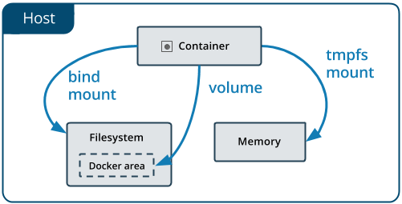
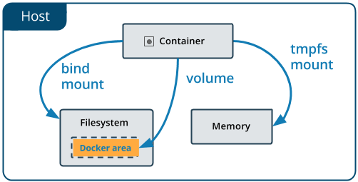
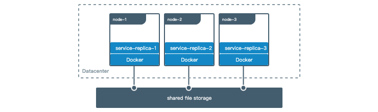
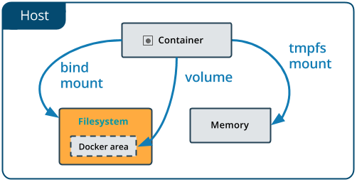
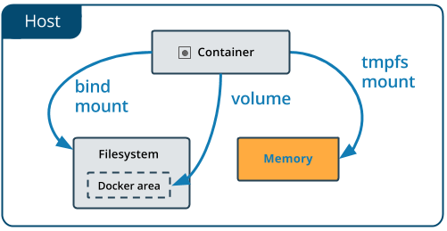

# 管理Docker中的数据
默认情况下，在容器内创建的所有文件都存储在可写容器层中。这意味着：

* 当该容器不再存在时，数据不会持久存在，并且如果另一个进程需要数据，则可能很难从容器中获取数据。
* 容器的可写层紧密耦合到运行容器的主机。无法轻松地将数据移动到其他位置。
* 写入容器的可写层需要 存储驱动程序来管理文件系统。存储驱动程序使用Linux内核提供联合文件系统。与使用直接写入主机文件系统的数据卷相比，这种额外的抽象降低了性能 。
Docker有两个容器选项可以在主机中存储文件，因此即使在容器停止之后文件仍然存在：和 。如果你在Linux上运行Docker，你也可以使用tmpfs mount。

继续阅读有关这两种持久数据方式的更多信息。

## 选择正确的安装类型
无论选择使用哪种类型的安装，数据在容器内看起来都是相同的。它作为目录或容器文件系统中的单个文件公开。

Volumes, Bind mounts和tmpfs mounts之间差异的简单方法是考虑数据在Docker主机上的位置。

* Volumes由Docker（/var/lib/docker/volumes/在Linux上）管理的主机文件系统的一部分中。非docker进程不应该修改文件系统的这一部分。是在docker中保留数据最佳方式
* Bind mounts可以存储在主机系统的任何位置。它们甚至可能是重要的系统文件或目录。Docker主机或Docker容器上的非Docker进程可以随时修改它们。
* tmpfs mounts仅存储在主机系统的内存中，永远不会写入主机系统的文件系统。

## 有关挂载的更多细节
* 由Docker创建和管理。可以使用该docker volume create命令显式创建卷，或者Docker可以在容器或服务创建期间创建卷。

创建卷时，它存储在Docker主机上的目录中。将卷装入容器时，此目录是装入容器的目录。这类似于绑定挂载的工作方式，除了卷由Docker管理并与主机的核心功能隔离。

给定的体积可以同时安装到多个容器中。当没有正在运行的容器正在使用卷时，该卷仍可供Docker使用，并且不会自动删除。可以使用删除未使用的卷docker volume prune。

装入卷时，可能会命名或匿名。匿名卷在首次装入容器时未给出明确的名称，因此Docker为它们提供了一个随机名称，该名称在给定的Docker主机中保证是唯一的。除名称外，命名和匿名卷的行为方式相同。

卷还支持使用卷驱动程序，这些驱动程序允许将数据存储在远程主机或云提供程序上，以及其他可能性。

* Bind Mounts：自Docker早期开始提供。与卷相比，绑定装载具有有限的功能。使用绑定装入时，主机上的文件或目录将装入容器中。文件或目录由主机上的完整路径引用。该文件或目录不需要已存在于Docker主机上。如果它尚不存在，则按需创建。绑定安装非常高效，但它们依赖于具有特定目录结构的主机文件系统。如果正在开发新的Docker应用程序，请考虑使用命名卷。无法使用Docker CLI命令直接管理绑定装入。

> 绑定挂载允许访问敏感文件:使用绑定装入的一个副作用，无论好坏，都可以通过容器中运行的进程更改主机文件系统 ，包括创建，修改或删除重要的系统文件或目录。这是一种强大的功能，可能会产生安全隐患，包括影响主机系统上的非Docker进程。

* tmpfs挂载：tmpfs挂载不会保留在磁盘上，无论是在Docker主机上还是在容器中。它可以在容器的生命周期中由容器使用，以存储非持久状态或敏感信息。例如，在内部，群集服务使用tmpfs挂载将秘密挂载到服务的容器中。

可以使用-v or --volume标志将bind mount和volumes装入容器，但每种装置的语法略有不同。对于tmpfs mount，可以使用该--tmpfs标志。但是，在Docker 17.06及更高版本中，我们建议--mount对容器和服务使用标志，对于bind mount，volumes或tmpfs mount，因为语法更清晰。

## 适用场景
### volume
卷是在Docker容器和服务中持久保存数据的首选方法。卷的一些用例包括：

* 在多个运行容器之间共享数据。如果未显式创建它，则会在第一次将其装入容器时创建卷。当该容器停止或被移除时，该卷仍然存在。多个容器可以同时安装相同的卷，可以是读写也可以是只读。仅在明确删除卷时才会删除卷。

* 当Docker主机不能保证具有给定的目录或文件结构时。卷可帮助将Docker主机的配置与容器运行时分离。

* 如果要将容器的数据存储在远程主机或云提供程序上，而不是本地存储。

* 当需要将数据从一个Docker主机备份，还原或迁移到另一个Docker主机时，卷是更好的选择。可以使用卷停止容器，然后备份卷的目录（例如/var/lib/docker/volumes/<volume-name>）。

### Bind mount
通常，应尽可能使用卷。绑定适用于以下类型的用例：

* 将配置文件从主机共享到容器。这就是Docker默认通过/etc/resolv.conf从主机安装到每个容器中来为容器提供DNS解析的方式 。

* 在Docker主机上的开发环境和容器之间共享源代码或构建工件。例如，可以将Maven target/ 目录挂载到容器中，每次在Docker主机上构建Maven项目时，容器都可以访问重建的工件。

如果以这种方式使用Docker进行开发，生产Dockerfile会将生产就绪的文件直接复制到映像中，而不是依赖于绑定装载。

* 当Docker主机的文件或目录结构保证与容器所需的绑定安装一致时。

### tmpfs mount
tmpfs当不希望数据在主机或容器内持久存在时，最好使用挂载。这可能是出于安全原因，或者在应用程序需要编写大量非持久状态数据时保护容器的性能。

## 使用volume或bind mount的注意点
如果使用绑定装入或卷，请记住以下几点：

* 如果将空volume装入容器中存在文件或文件夹的目录中，则会将这些文件或目录传播（复制）到卷中。同样，如果启动容器并指定尚不存在的文件夹，则会为创建一个空文件夹。这是预先填充另一个容器所需数据的好方法。

* 如果将bind mount或非空volume装入容器中存在某些文件或目录的目录中，则主机中文件或目录会遮盖容器中这些文件或目录，就像将文件保存到/mnt Linux主机上然后安装USB驱动器进入/mnt。/mnt在卸载USB驱动器之前，USB驱动器的内容会遮挡内容。隐藏的文件不会被删除或更改，但在安装绑定装载或卷时无法访问。

## volume
卷是保存Docker容器生成和使用的数据的首选机制。虽然绑定挂载依赖于主机的目录结构，但卷完全由Docker管理。卷绑定安装有几个优点：

* 与绑定装载相比，卷更易于备份或迁移。
* 可以使用Docker CLI命令或Docker API管理卷。
* 卷适用于Linux和Windows容器。
* 可以在多个容器之间更安全地共享卷。
* 卷驱动程序允许在远程主机或云提供程序上存储卷，加密卷的内容或添加其他功能。
* 新卷可以通过容器预先填充其内容。
此外，卷通常是比容器的可写层中的持久数据更好的选择，因为卷不会增加使用它的容器的大小，并且卷的内容存在于给定容器的生命周期之外。


如果容器生成非持久状态数据，请考虑使用 tmpfs mount以避免将数据永久存储在任何位置，并通过避免写入容器的可写层来提高容器的性能。

mount使用rprivate绑定共享，并且卷不可配置绑定共享。

### Choose the -v or --mount flag
最初，-v 或 --volume标志用于独立容器，--mount标志用于群组服务。但是，从Docker 17.06开始，还可以使用--mount独立容器。一般来说， --mount更明确和冗长。最大的区别在于-v 语法将所有选项组合在一个字段中，而--mount 语法将它们分开。以下是每个标志的语法比较。
> 新用户应该尝试--mount比--volume语法更简单的语法。

如果需要指定卷驱动程序选项，则必须使用--mount。
* -v或--volume：由三个字段组成，用冒号字符（:）分隔。字段必须按正确的顺序排列，并且每个字段的含义不是很明显。
    * 对于命名卷，第一个字段是卷的名称，并且在给定主机上是唯一的。对于匿名卷，省略第一个字段。
    * 第二个字段是文件或目录在容器中安装的路径。
    * 第三个字段是可选的，是逗号分隔的选项列表，例如ro。这些选项将在下面讨论。
* --mount：由多个键值对组成，以逗号分隔，每个键\<key>=\<value>组由一个元组组成。该--mount语法比更详细的-v或--volume，但按键的顺序并不显著，并且标志的价值更容易理解。
    * 该type安装件，其可以是bind，volume，或 tmpfs。本主题讨论卷，因此类型始终如此 volume。
    * 该source安装的。对于命名卷，这是卷的名称。对于匿名卷，省略此字段。可以指定为source 或src。
    * 将destination文件或目录安装在容器中的路径作为其值。可以指定为destination，dst或target。
    * 该readonly选项（如果存在）导致绑定装入以只读方式装入容器中。
    * 该volume-opt选项可以多次指定，它采用由选项名称及其值组成的键值对。
  
> 从外部CSV解析器中转义值
    如果卷驱动程序接受以逗号分隔的列表作为选项，则必须从外部CSV解析器中转义该值。要转义a volume-opt，请用双引号括起来（"）并用单引号括起整个mount参数（'）。

例如，local驱动程序接受mount选项作为o参数中以逗号分隔的列表。此示例显示了转义列表的正确方法。
```
    $ docker service create \
     --mount 'type=volume,src=<VOLUME-NAME>,dst=<CONTAINER-PATH>,volume-driver=local,volume-opt=type=nfs,volume-opt=device=<nfs-server>:<nfs-path>,"volume-opt=o=addr=<nfs-address>,vers=4,soft,timeo=180,bg,tcp,rw"'
    --name myservice \
    <IMAGE>
 ```
下面的示例显示了可能的语法--mount和-v语法，并 --mount首先给出。
#### -v和--mount行为之间的差异
与绑定装载相反，卷的所有选项都可用于 标志--mount和-v标志。

使用具有服务的卷时，仅--mount支持。

### 创建和管理volume
与bind mount不同，可以创建和管理任何容器范围之外的volume。

#### 创建一个volume：
##### 创建一个卷：
```
$ docker volume create my-vol
```
##### 查看卷列表：
```
$ docker volume ls

local               my-vol
```
##### 检查卷：
```
$ docker volume inspect my-vol
[
    {
        "CreatedAt": "2019-07-10T07:34:44Z",
        "Driver": "local",
        "Labels": {},
        "Mountpoint": "/var/lib/docker/volumes/my-vol/_data",
        "Name": "my-vol",
        "Options": {},
        "Scope": "local"
    }
]
```
##### 删除卷：
```
$ docker volume rm my-vol
```
### 启动具有卷的容器
如果启动具有尚不存在的卷的容器，Docker会为创建卷。以下示例将卷myvol2装入 /app/容器中。

所述-v和--mount以下实施例产生相同的结果。除非在运行第一个devtest容器和myvol2卷之后删除容器和卷，否则无法同时运行它们。
```
--mount 方式
$ docker run -d \
  --name devtest \
  --mount source=myvol2,target=/app \
  nginx:latest

-v 方式
 $ docker run -d \
  --name devtest \
  -v myvol2:/app \
  nginx:latest 
```
使用docker inspect devtest验证创建卷并安装正确。寻找Mounts部分：
```
...
"Mounts": [
    {
        "Type": "volume",
        "Name": "myvol2",
        "Source": "/var/lib/docker/volumes/myvol2/_data",
        "Destination": "/app",
        "Driver": "local",
        "Mode": "",
        "RW": true,
        "Propagation": ""
    }
],
...
```
这表明mount是一个卷，它显示正确的源和目标，并且mount是可读写的。

停止容器并移除卷。注意删除卷是一个单独的步骤。
```
$ docker container stop devtest

$ docker container rm devtest

$ docker volume rm myvol2
```
### 使用卷启动服务
启动服务并定义卷时，每个服务容器都使用自己的本地卷。如果使用local 卷驱动程序，则所有容器都不能共享此数据，但某些卷驱动程序确实支持共享存储。Docker for AWS和Docker for Azure都支持使用Cloudstor插件的持久存储。

以下示例启动nginx具有四个副本的服务，每个副本使用一个名为的本地卷myvol2。
```
$ docker service create -d \
  --replicas=4 \
  --name devtest-service \
  --mount source=myvol2,target=/app \
  nginx:latest
```
使用docker service ps devtest-service验证服务正在运行：
```
$ docker service ps devtest-service

ID                  NAME                IMAGE               NODE                DESIRED STATE       CURRENT STATE            ERROR               PORTS
4d7oz1j85wwn        devtest-service.1   nginx:latest        moby                Running             Running 14 seconds ago
```
删除服务，停止其所有任务：
```
$ docker service rm devtest-service
```
删除该服务不会删除该服务创建的任何卷。去除卷是一个单独的步骤。

#### 服务的语法差异
该docker service create命令不支持-v或--volume标志。将卷安装到服务的容器中时，必须使用该--mount 标志。

### 使用容器填充卷
如果启动一个创建新卷的容器（如上所述），并且容器在要挂载的目录中具有文件或目录（/app/如上所述），则将目录的内容复制到卷中。然后容器安装并使用该卷，而使用该卷的其他容器也可以访问预先填充的内容。

为了说明这一点，此示例启动一个nginx容器，并nginx-vol使用容器/usr/share/nginx/html目录的内容 填充新卷，这是Nginx存储其默认HTML内容的位置。

这些--mount和-v示例具有相同的最终结果。

--mount
```
$ docker run -d \
  --name=nginxtest \
  --mount source=nginx-vol,destination=/usr/share/nginx/html \
  nginx:latest
```
运行这些示例之一后，运行以下命令以清理容器和卷。注意删除卷是一个单独的步骤。
```
$ docker container stop nginxtest

$ docker container rm nginxtest

$ docker volume rm nginx-vol
```
### 使用只读卷
对于某些开发应用程序，容器需要写入绑定装入，以便将更改传播回Docker主机。在其他时候，容器只需要对数据的读访问权。请记住，多个容器可以安装相同的卷，并且可以为其中一些容器以读写方式挂载，同时为其他容器以只读方式挂载。

此示例修改上面的一个，但通过ro在容器中的挂载点之后添加（默认为空）选项列表，将目录挂载为只读卷。如果存在多个选项，请用逗号分隔。

这些--mount和-v示例具有相同的结果。
--mount
```
$ docker run -d \
  --name=nginxtest \
  --mount source=nginx-vol,destination=/usr/share/nginx/html,readonly \
  nginx:latest
或
  $ docker run -d \
  --name=nginxtest \
  -v nginx-vol:/usr/share/nginx/html:ro \
  nginx:latest
```
使用docker inspect nginxtest验证只读坐骑正确创建。寻找Mounts部分：
```
...
"Mounts": [
    {
        "Type": "volume",
        "Name": "nginx-vol",
        "Source": "/var/lib/docker/volumes/nginx-vol/_data",
        "Destination": "/usr/share/nginx/html",
        "Driver": "local",
        "Mode": "",
        "RW": false,
        "Propagation": ""
    }
],
...
```
停止并取出容器，然后取出卷。去除卷是一个单独的步骤。
```
docker container stop nginxtest

docker container rm nginxtest

docker volume rm nginx-vol
```
### 在机器之间共享数据(未测试)
构建容错应用程序时，可能需要配置同一服务的多个副本才能访问相同的文件。



在开发应用程序时，有几种方法可以实现此目的。一种是为应用程序添加逻辑，以将文件存储在Amazon S3等云对象存储系统上。另一种方法是使用支持将文件写入NFS或Amazon S3等外部存储系统的驱动程序创建卷。

卷驱动程序允许从应用程序逻辑中抽象底层存储系统。例如，如果服务使用具有NFS驱动程序的卷，则可以更新服务以使用其他驱动程序，例如在云中存储数据，而无需更改应用程序逻辑。

#### 使用volime驱动
使用创建卷时docker volume create，或者启动使用尚未创建的卷的容器时，可以指定卷驱动程序。以下示例使用vieux/sshfs卷驱动程序，首先在创建独立卷时使用，然后在启动创建新卷的容器时使用。

##### 初始设置
此示例假定有两个节点，第一个节点是Docker主机，可以使用SSH连接到第二个节点。

在Docker主机上，安装vieux/sshfs插件：

$ docker plugin install --grant-all-permissions vieux/sshfs
##### 使用卷驱动程序创建卷
此示例指定SSH密码，但如果两台主机配置了共享密钥，则可以省略密码。每个卷驱动程序可以具有零个或多个可配置选项，每个选项都使用-o标志指定。
```
$ docker volume create --driver vieux/sshfs \
  -o sshcmd=test@node2:/home/test \
  -o password=testpassword \
  sshvolume
```
##### 启动使用卷驱动程序创建卷的容器
此示例指定SSH密码，但如果两台主机配置了共享密钥，则可以省略密码。每个卷驱动程序可以具有零个或多个可配置选项。如果卷驱动程序要求传递选项，则必须使用该--mount标志来装入卷，而不是-v。
```
$ docker run -d \
  --name sshfs-container \
  --volume-driver vieux/sshfs \
  --mount src=sshvolume,target=/app,volume-opt=sshcmd=test@node2:/home/test,volume-opt=password=testpassword \
  nginx:latest
```
##### 创建一个创建NFS卷的服务
此示例显示如何在创建服务时创建NFS卷。此示例10.0.0.10用作NFS服务器和NFS服务器上/var/docker-nfs的导出目录。请注意，指定的卷驱动程序是local。

NFSV3:
```
$ docker service create -d \
  --name nfs-service \
  --mount 'type=volume,source=nfsvolume,target=/app,volume-driver=local,volume-opt=type=nfs,volume-opt=device=:/var/docker-nfs,volume-opt=o=addr=10.0.0.10' \
  nginx:latest
```
NFSV4:
```
docker service create -d \
    --name nfs-service \
    --mount 'type=volume,source=nfsvolume,target=/app,volume-driver=local,volume-opt=type=nfs,volume-opt=device=:/,"volume-opt=o=10.0.0.10,rw,nfsvers=4,async"' \
    nginx:latest
```
#### 备份，还原或迁移数据卷
卷对备份，还原和迁移很有用。使用该 --volumes-from标志创建一个安装该卷的新容器。

##### 备份容器
例如，在下一个命令中，我们：

* 启动新容器并从dbstore容器装入卷
* 将本地主机目录挂载为 /backup
* 将dbdata卷内容的命令传递给目录中的backup.tar文件/backup。
```
$ docker run --rm --volumes-from dbstore -v $(pwd):/backup ubuntu tar cvf /backup/backup.tar /dbdata
```
当命令完成并且容器停止时，我们将留下我们dbdata卷的备份。

##### 从备份还原容器
使用刚刚创建的备份，可以将其还原到同一容器或在其他位置创建的另一个容器。

例如，创建一个名为的新容器dbstore2：
```
$ docker run -v /dbdata --name dbstore2 ubuntu /bin/bash
```
然后解压缩新容器的数据卷中的备份文件：
```
$ docker run --rm --volumes-from dbstore2 -v $(pwd):/backup ubuntu bash -c "cd /dbdata && tar xvf /backup/backup.tar --strip 1"
```
可以使用上述技术使用首选工具自动执行备份，迁移和还原测试。

##### 删除卷
删除容器后，Docker数据卷仍然存在。要考虑两种类型的卷：

* 命名卷具有来自容器外部的特定源awesome:/bar。
* 匿名卷没有特定的源，因此在删除容器时，指示Docker Engine守护程序删除它们。
##### 删除匿名卷
要自动删除匿名卷，请使用该--rm选项。例如，此命令创建匿名/foo卷。移除容器后，Docker Engine会删除/foo卷但不会删除awesome卷。
```
$ docker run --rm -v /foo -v awesome:/bar busybox top
```
##### 删除所有卷
要删除所有未使用的卷并释放空间：
```
$ docker volume prune
```

## Bind Mount
自Docker早期以来，绑定坐骑一直存在。与卷相比，绑定装载具有有限的功能。使用绑定装入时，主机上的文件或目录将装入容器中。文件或目录由其在主机上的完整路径或相对路径引用。相反，当使用卷时，会在主机上的Docker存储目录中创建一个新目录，Docker会管理该目录的内容。

该文件或目录不需要已存在于Docker主机上。如果它尚不存在，则按需创建。绑定安装非常高效，但它们依赖于具有特定目录结构的主机文件系统。如果正在开发新的Docker应用程序，请考虑使用命名卷。无法使用Docker CLI命令直接管理绑定装入。



### 选择-v或--mount标志
最初，-v或--volume标志用于独立容器，--mount标志用于群组服务。但是，从Docker 17.06开始，还可以使用--mount独立容器。一般来说， --mount更明确和冗长。最大的区别在于-v 语法将所有选项组合在一个字段中，而--mount 语法将它们分开。以下是每个标志的语法比较。

> 提示：新用户应使用--mount语法。有经验的用户可能更熟悉-v或--volume语法，但鼓励使用--mount，因为研究表明它更容易使用。

* -v或--volume：由三个字段组成，用冒号字符（:）分隔。字段必须按正确的顺序排列，并且每个字段的含义不是很明显。
    * 对于绑定装入，第一个字段是主机上文件或目录的路径。
    * 第二个字段是文件或目录在容器中安装的路径。
    * 第三个字段是可选的，并且是用逗号分隔的选项，诸如列表ro，consistent，delegated，cached，z，和Z。这些选项将在下面讨论。
* --mount：由多个键值对组成，以逗号分隔，每个键\<key>=\<value>组由一个元组组成。该--mount语法比更详细的-v或--volume，但按键的顺序并不显著，并且标志的价值更容易理解。
    * 该type安装件，其可以是bind，volume，或tmpfs。本主题讨论绑定装入，因此类型始终是bind。
    * 该source安装的。对于绑定装入，这是Docker守护程序主机上的文件或目录的路径。可以指定为source或 src。
    * 将destination文件或目录安装在容器中的路径作为其值。可以指定为destination，dst或target。
    * 该readonly选项（如果存在）导致绑定装入以只读方式装入容器中。
    * 该bind-propagation选项（如果存在）会更改 绑定传播。可以是一个rprivate， private，rshared，shared，rslave，slave。
    * 的consistency选项，如果存在，可以是一种consistent，delegated或cached。此设置仅适用于Docker Desktop for Mac，在所有其他平台上均被忽略。
    * 该--mount标志不支持z或Z修改selinux标签的选项。
下面的示例显示了可能的语法--mount和-v语法，并 --mount首先给出。

### -v和--mount行为之间的差异
因为-v和--volumeflags一直是Docker的一部分，所以它们的行为无法改变。这意味着在-v和之间存在一种不同的行为--mount。

如果使用-v或--volume绑定装载Docker主机上尚不存在的文件或目录，请-v为创建端点。它始终作为目录创建。

如果使用--mount绑定贴装尚不泊坞窗主机上存在的文件或目录，码头工人也不会自动为创建它，但会产生一个错误。

### 使用bind mount启动容器
考虑一个你有一个目录的情况source，当你构建源代码时，工件被保存到另一个目录中source/target/。希望工件可用于容器/app/，并且希望每次在开发主机上构建源时容器都可以访问新构建。使用以下命令将target/ 目录绑定到容器中/app/。从source目录中运行该命令 。该$(pwd)子命令将扩展到Linux或者MacOS主机的当前工作目录。

所述--mount和-v以下实施例产生相同的结果。除非devtest在运行第一个容器后删除容器，否则不能同时运行它们。
```
docker run -d \
  -it \
  --name devtest \
  --mount type=bind,source="$(pwd)"/target,target=/app \
  nginx:latest
或
docker run -d \
  -it \
  --name devtest \
  -v "$(pwd)"/target:/app \
  nginx:latest
```
使用docker inspect devtest验证绑定安装正确创建。寻找Mounts部分：
```
...
"Mounts": [
    {
        "Type": "bind",
        "Source": "/tmp/source/target",
        "Destination": "/app",
        "Mode": "",
        "RW": true,
        "Propagation": "rprivate"
    }
],
...
```
这表明mount是一个bindmount，它显示了正确的源和目标，它表明mount是读写的，并且传播设置为rprivate。

停止容器：
```
$ docker container stop devtest

$ docker container rm devtest
```
### 挂载到容器上的非空目录中
如果将bind-mount绑定到容器上的非空目录中，则绑定装置会隐藏目录的现有内容。这可能是有益的，例如当想要在不构建新图像的情况下测试新版本的应用程序时。但是，它也可能令人惊讶，并且此行为与docker卷的行为不同。

此示例设计为极端，但将容器/usr/目录的内容替换/tmp/为主机上的目录。在大多数情况下，这会导致容器无法运行。

这些--mount和-v示例具有相同的最终结果。
```
--mount
$ docker run -d \
  -it \
  --name broken-container \
  --mount type=bind,source=/tmp,target=/usr \
  nginx:latest

docker: Error response from daemon: oci runtime error: container_linux.go:262:
starting container process caused "exec: \"nginx\": executable file not found in $PATH".
或
-v
docker run -d \
  -it \
  --name broken-container \
  -v /tmp:/usr \
  nginx:latest

docker: Error response from daemon: oci runtime error: container_linux.go:262:
starting container process caused "exec: \"nginx\": executable file not found in $PATH".
```
容器已创建但无法启动。去掉它：
```
$ docker container rm broken-container
```

### 使用只读绑定装载
对于某些开发应用程序，容器需要写入绑定装入，因此更改会传播回Docker主机。在其他时候，容器只需要读访问权限。

此示例修改上面的示例，但ro通过在容器中的挂载点之后添加（默认为空）选项列表，将目录挂载为只读绑定挂载。如果存在多个选项，请用逗号分隔。

这些--mount和-v示例具有相同的结果。
```
--mount
$ docker run -d \
  -it \
  --name devtest \
  --mount type=bind,source="$(pwd)"/target,target=/app,readonly \
  nginx:latest

-v
docker run -d \
  -it \
  --name devtest \
  -v "$(pwd)"/target:/app:ro \
  nginx:latest
```
使用docker inspect devtest验证绑定安装正确创建。寻找Mounts部分：
```
...
"Mounts": [
    {
        "Type": "bind",
        "Source": "/tmp/source/target",
        "Destination": "/app",
        "Mode": "ro",
        "RW": false,
        "Propagation": "rprivate"
    }
],
...
```
停止容器：
```
$ docker container stop devtest

$ docker container rm devtest
```

### 配置绑定传播(未测试)
绑定传播默认rprivate为绑定装入和卷。它仅可用于绑定装入，并且仅适用于Linux主机。绑定传播是一个高级主题，许多用户永远不需要配置它。

绑定传播是指在给定的绑定装载或命名卷中创建的装载是否可以传播到该装载的副本。考虑一个安装点/mnt，它也安装在上面/tmp。传播设置控制是否/tmp/a也可以使用挂载/mnt/a。每个传播设置都有一个递归对位。在递归的情况下，请考虑将/tmp/a其挂载为/foo。传播设置控制是否/mnt/a和/或/tmp/a将存在。

|传播设置|	描述|
| --- | --- |
|shared	|原始安装的子安装将暴露给副本安装，副安装的副安装也会传播到原始安装。|
|slave	|类似于共享安装，但只在一个方向上。如果原始安装程序公开子安装，则副本安装程序可以看到它。但是，如果副本装置公开了子装载，则原始装载无法看到它。|
|private	|山是私人的。其中的子安装不会暴露给副本安装，副安装的副安装不会暴露给原始安装。|
|rshared	|与共享相同，但传播也扩展到嵌套在任何原始或副本装入点中的装入点。|
|rslave|	与从属相同，但传播也延伸到嵌套在任何原始或副本装入点内的装入点。|
|rprivate	|默认。与private相同，意味着原始或副本装入点中任何位置的装载点都不会沿任一方向传播。|
在可以在挂载点上设置绑定传播之前，主机文件系统需要已经支持绑定传播。

有关绑定传播的更多信息，请参阅共享子树的 Linux内核文档。

以下示例将target/目录装入容器两次，第二个装置同时设置ro选项和rslave绑定传播选项。

这些--mount和-v示例具有相同的结果。
```
--mount
docker run -d \
  -it \
  --name devtest \
  --mount type=bind,source="$(pwd)"/target,target=/app \
  --mount type=bind,source="$(pwd)"/target,target=/app2,readonly,bind-propagation=rslave \
  nginx:latest
或
-v
$ docker run -d \
  -it \
  --name devtest \
  -v "$(pwd)"/target:/app \
  -v "$(pwd)"/target:/app2:ro,rslave \
  nginx:latest
  ```
现在，如果你创建/app/foo/，/app2/foo/也存在。

### 配置selinux标签(未测试)
如果使用selinux，可以添加z或Z选项以修改要装入容器的主机文件或目录的selinux标签。这会影响主机本身上的文件或目录，并且可能会产生Docker范围之外的后果。

* 该z选项表示绑定装载内容在多个容器之间共享。
* 该Z选项表示绑定装载内容是私有和非共享的。
使用极端谨慎使用这些选项。绑定安装系统目录（例如/home或/usr使用该Z选项）会导致主机无法运行，可能需要手动重新标记主机文件。

> 重要提示：将bind mounts与服务一起使用时，selinux标签（:Z和:z）以及:ro被忽略。有关详细信息，请参阅 moby / moby＃32579。

此示例设置z选项以指定多个容器可以共享绑定装载的内容：

无法使用--mount标志修改selinux标签。
```
$ docker run -d \
  -it \
  --name devtest \
  -v "$(pwd)"/target:/app:z \
  nginx:latest
```

### 配置macOS的安装一致性
Docker Desktop for Mac用于osxfs将从macOS共享的目录和文件传播到Linux VM。此传播使这些目录和文件可供Docker容器在Docker Desktop for Mac上运行。

默认情况下，这些共享是完全一致的，这意味着每次在macOS主机上或通过容器中的安装进行写入时，更改都会刷新到磁盘，以便共享中的所有参与者都具有完全一致的视图。在某些情况下，完全一致性会严重影响性能。Docker 17.05及更高版本引入了一些选项，可以按容器/容器调整一致性设置。可以使用以下选项：

* consistent或default：具有完全一致性的默认设置，如上所述。

* delegated：容器运行时的mount视图是权威的。在容器中进行的更新在主机上可见之前可能会有延迟。

* cached：macOS主机的mount视图是权威的。在主机上进行的更新在容器中可见之前可能会有延迟。

除macOS外，所有主机操作系统都完全忽略这些选项。

这些--mount和-v示例具有相同的结果。
```
--mount
docker run -d \
  -it \
  --name devtest \
  --mount type=bind,source="$(pwd)"/target,destination=/app,consistency=cached \
  nginx:latest

-v
 docker run -d \
  -it \
  --name devtest \
  -v "$(pwd)"/target:/app:cached \
  nginx:latest

```

## tmpfs mounts
卷和绑定装置允许在主机和容器之间共享文件，以便即使在容器停止后也可以保留数据。

如果你在Linux上运行Docker，你有第三个选择：tmpfsmounts。当使用tmpfsmount 创建容器时，容器可以在容器的可写层之外创建文件。

与卷和绑定挂载相反，tmpfs挂载是临时的，并且仅保留在主机内存中。当容器停止时，将tmpfs删除安装，并且不会保留写在那里的文件。


这对于临时存储不希望在主机或容器可写层中保留的敏感文件很有用。

### tmpfs安装的限制
与volume和bind mount不同，无法tmpfs在容器之间共享装载。
只有在Linux上运行Docker时才能使用此功能。
### 选择--tmpfs或--mount标志
最初，该--tmpfs标志用于独立容器，该--mount标志用于群服务。但是，从Docker 17.06开始，还可以使用--mount独立容器。一般来说， --mount更明确和冗长。最大的区别是该 * --tmpfs标志不支持任何可配置选项。

* --tmpfs：安装tmpfs挂载而不允许指定任何可配置选项，并且只能与独立容器一起使用。

* --mount：由多个键值对组成，以逗号分隔，每个键\<key>=\<value>组由一个元组组成。该--mount语法比更详细--tmpfs：

  * 该type安装件，其可以是bind，volume，或 tmpfs。本主题讨论tmpfs，因此类型始终如此 tmpfs。
  * 将安装件安装在容器中destination的路径作为其值tmpfs。可以指定为destination，dst或target。
  * 在tmpfs-type和tmpfs-mode选项。请参阅 tmpfs选项。
下面的示例显示了可能的语法--mount和--tmpfs语法，并--mount首先给出。

#### --tmpfs和--mount行为之间的差异
* 该--tmpfs标志不允许指定任何可配置选项。
* 该--tmpfs标志不能与swarm服务一起使用。你必须使用--mount。
### 在容器中使用tmpfs mount
要tmpfs在容器中使用安装，请使用--tmpfs标志，或使用--mount带有type=tmpfs和destination选项的 标志。没有 source了tmpfs坐骑。以下示例在Nginx容器中创建tmpfsmount /app。第一个示例使用--mount标志，第二个示例使用--tmpfs标志。
```
--mount
$ docker run -d \
  -it \
  --name tmptest \
  --mount type=tmpfs,destination=/app \
  nginx:latest
或
--tmpfs
$ docker run -d \
  -it \
  --name tmptest \
  --tmpfs /app \
  nginx:latest
```
tmpfs通过运行docker container inspect tmptest并查找该Mounts部分来验证安装是否为mount ：
```
"Tmpfs": {
    "/app": ""
},
```
删除容器：
```
$ docker container stop tmptest

$ docker container rm tmptest
```
#### 指定tmpfs选项
tmpfs安装允许两个配置选项，这两个选项都不是必需的。如果需要指定这些选项，则必须使用该--mount标志，因为该--tmpfs标志不支持它们。

|选项|	描述|
| -- | -- |
|tmpfs-size|	tmpfs的大小以字节为单位。默认无限制。|
|tmpfs-mode|	八进制中tmpfs的文件模式。例如，700或0770。|默认为1777或世界可写。
以下示例将tmpfs-modeto 设置为1770，以便它在容器中不是世界可读的。
```
docker run -d \
  -it \
  --name tmptest \
  --mount type=tmpfs,destination=/app,tmpfs-mode=1770 \
  nginx:latest
```

## 可能的错误
[volume errors](https://docs.docker.com/storage/troubleshooting_volume_errors/)

