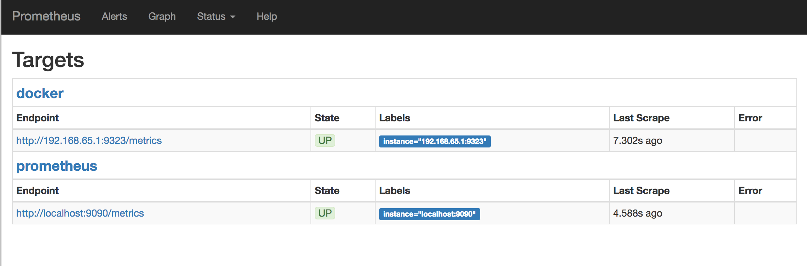
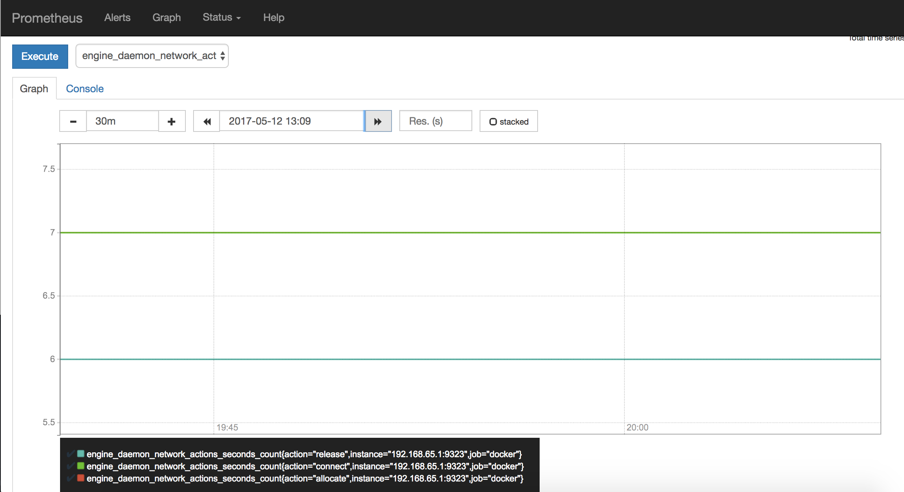
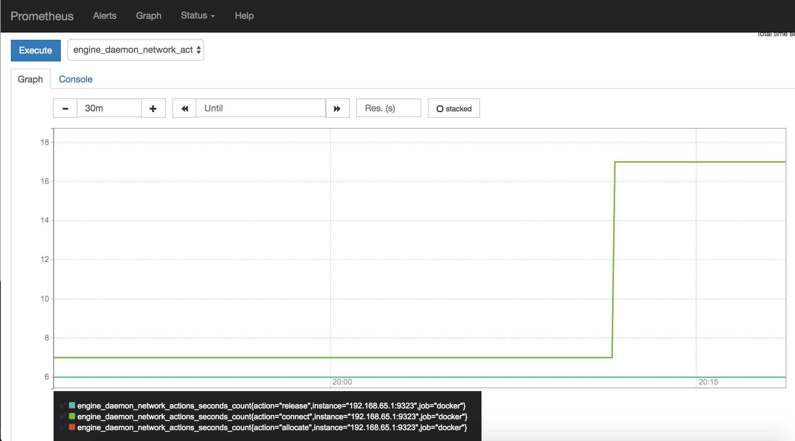

## 删除未使用的对象

Docker采用保守的方法来清理未使用的对象（通常称为“垃圾收集”），例如图像，容器，卷和网络：除非明确要求Docker这样做，否则这些对象通常不会被删除。这可能导致Docker使用额外的磁盘空间。对于每种类型的对象，Docker都提供了一个prune命令。此外，可以使用docker system prune一次清理多种类型的对象。本主题说明如何使用这些prune命令。

### 修剪图像
该docker image prune命令允许清理未使用的图像。默认情况下，docker image prune仅清除悬空图像。悬挂图像是未标记的图像，不会被任何容器引用。要删除悬空图像：
```
$ docker image prune

WARNING! This will remove all dangling images.
Are you sure you want to continue? [y/N] y
```
要删除现有容器未使用的所有图像，请使用以下-a 标志：
```
$ docker image prune -a

WARNING! This will remove all images without at least one container associated to them.
Are you sure you want to continue? [y/N] y
```
默认情况下，系统会提示继续。要绕过提示，请使用-f或 --force标记。

可以使用带有--filter标志的过滤表达式限制修剪哪些图像 。例如，要仅考虑超过24小时前创建的图像：
```
$ docker image prune -a --filter "until=24h"
```
其他过滤表达式可用。有关 更多示例，请参阅 docker image prune参考。

### 修剪容器
停止容器时，除非使用该--rm标志启动容器，否则不会自动删除容器。要查看Docker主机上的所有容器，包括已停止的容器，请使用docker ps -a。可能会惊讶地发现存在多少个容器，尤其是在开发系统上！停止的容器的可写层仍占用磁盘空间。要清除它，可以使用该docker container prune命令。
```
$ docker container prune

WARNING! This will remove all stopped containers.
Are you sure you want to continue? [y/N] y
```
默认情况下，系统会提示继续。要绕过提示，请使用-f或 --force标记。

默认情况下，将删除所有已停止的容器。可以使用--filter标志限制范围。例如，以下命令仅删除超过24小时的已停止容器：
```
$ docker container prune --filter "until=24h"
```
其他过滤表达式可用。有关 更多示例，请参阅 docker container prune参考。

### 修剪volume
卷可以由一个或多个容器使用，占用Docker主机上的空间。永远不会自动删除卷，因为这样做可能会破坏数据。
```
$ docker volume prune

WARNING! This will remove all volumes not used by at least one container.
Are you sure you want to continue? [y/N] y
```
默认情况下，系统会提示继续。要绕过提示，请使用-f或 --force标记。

默认情况下，将删除所有未使用的卷。可以使用--filter标志限制范围。例如，以下命令仅删除未标记keep标签的卷：
```
$ docker volume prune --filter "label!=keep"
```
其他过滤表达式可用。有关 更多示例，请参阅 docker volume prune参考。

### 修剪网络
Docker网络不占用太多磁盘空间，但它们确实创建iptables 规则，桥接网络设备和路由表条目。要清理这些内容，可以使用docker network prune清理任何容器未使用的网络。
```
$ docker network prune

WARNING! This will remove all networks not used by at least one container.
Are you sure you want to continue? [y/N] y
```
默认情况下，系统会提示继续。要绕过提示，请使用-f或 --force标记。

默认情况下，将删除所有未使用的网络。可以使用--filter标志限制范围。例如，以下命令仅删除超过24小时的网络：

$ docker network prune --filter "until=24h"
其他过滤表达式可用。有关 更多示例，请参阅 docker network prune参考。

### 修剪所有
该docker system prune命令是修剪图像，容器和网络的快捷方式。在Docker 17.06.0及更早版本中，卷也被修剪。在Docker 17.06.1及更高版本中，必须指定修剪卷的--volumes标志 docker system prune。
```
$ docker system prune

WARNING! This will remove:
        - all stopped containers
        - all networks not used by at least one container
        - all dangling images
        - all build cache
Are you sure you want to continue? [y/N] y
```
如果使用的是Docker 17.06.1或更高版本，并且还希望修剪卷，请添加--volumes标记：
```
$ docker system prune --volumes

WARNING! This will remove:
        - all stopped containers
        - all networks not used by at least one container
        - all volumes not used by at least one container
        - all dangling images
        - all build cache
Are you sure you want to continue? [y/N] y
```
默认情况下，系统会提示继续。要绕过提示，请使用-f或 --force标记。

## 格式化命令和日志输出
Docker使用Go模板，可以使用它来操纵某些命令和日志驱动程序的输出格式。

Docker提供了一组操作模板元素的基本功能。所有这些示例都使用该docker inspect命令，但许多其他CLI命令都有一个--format标志，许多CLI命令引用都包含自定义输出格式的示例。

### join
join连接字符串列表以创建单个字符串。它在列表中的每个元素之间放置一个分隔符。
```
docker inspect --format '{{join .Args " , "}}' container
```
### JSON
json 将元素编码为json字符串。
```
docker inspect --format '{{json .Mounts}}' container
```
### lower
lower 将字符串转换为小写表示形式。
```
docker inspect --format "{{lower .Name}}" container
```
### split
split 将字符串切片到由分隔符分隔的字符串列表中。
```
docker inspect --format '{{split .Image ":"}}'
```
### title
title 大写字符串的第一个字符。
```
docker inspect --format "{{title .Name}}" container
```
### upper
upper 将字符串转换为大写字母。
```
docker inspect --format "{{upper .Name}}" container
```
println
println 在新行上打印每个值。
```
docker inspect --format='{{range .NetworkSettings.Networks}}{{println .IPAddress}}{{end}}' container
```
Hint
要找出可以打印的数据，请将所有内容显示为json：
```
docker container ls --format='{{json .}}'
```

## docker配置和运行
https://docs.docker.com/config/daemon/

## systemd docker、proxy代理配置
https://docs.docker.com/config/daemon/systemd/

## 配置docker日志驱动
https://docs.docker.com/config/containers/logging/configure/

## [使用Prometheus收集Docker指标](https://docs.docker.com/config/thirdparty/prometheus/)
Prometheus是一个开源系统监控和警报工具包。可以将Docker配置为Prometheus目标。本主题介绍如何配置Docker，将Prometheus设置为作为Docker容器运行，以及如何使用Prometheus监控Docker实例。

> 警告：可用的指标和这些指标的名称处于活动开发状态，可能随时更改。

目前，只能监控Docker本身。目前无法使用Docker目标监控应用程序。

### 配置Docker
要将Docker守护程序配置为Prometheus目标，需要指定 metrics-address。最好的方法是通过daemon.json，默认情况下位于以下位置之一。如果该文件不存在，请创建它。

* Linux：/etc/docker/daemon.json
* Windows Server：C:\ProgramData\docker\config\daemon.json
* Docker Desktop for Mac / Docker Desktop for Windows：单击工具栏中的Docker图标，选择Preferences，然后选择Daemon。单击高级。
如果文件当前为空，请粘贴以下内容：
```
{
  "metrics-addr" : "127.0.0.1:9323",
  "experimental" : true
}
```
如果文件不为空，请添加这两个键，确保生成的文件是有效的JSON。注意,除了最后一行之外，每一行都以逗号（）结尾。

保存文件，或者在Docker Desktop for Mac或Docker Desktop for Windows的情况下，保存配置。重启Docker。

Docker现在在端口9323上公开了与Prometheus兼容的指标。

### 配置并运行Prometheus
Prometheus作为Docker群上的Docker服务运行。

#### 先决条件

一个或多个Docker引擎连接到Docker swarm，docker swarm init 在一个管理器和docker swarm join其他管理器和工作节点上使用。

你需要一个互联网连接来拉普罗米修斯的形象。

复制以下配置文件之一并将其保存到 /tmp/prometheus.yml（Linux或Mac）或C:\tmp\prometheus.yml（Windows）。这是一个库存Prometheus配置文件，除了在文件底部添加Docker作业定义。适用于Mac的Docker Desktop和适用于Windows的Docker Desktop需要稍微不同的配置。

适用于Linux的Docker
```
# my global config
global:
  scrape_interval:     15s # Set the scrape interval to every 15 seconds. Default is every 1 minute.
  evaluation_interval: 15s # Evaluate rules every 15 seconds. The default is every 1 minute.
  # scrape_timeout is set to the global default (10s).

  # Attach these labels to any time series or alerts when communicating with
  # external systems (federation, remote storage, Alertmanager).
  external_labels:
      monitor: 'codelab-monitor'

# Load rules once and periodically evaluate them according to the global 'evaluation_interval'.
rule_files:
  # - "first.rules"
  # - "second.rules"

# A scrape configuration containing exactly one endpoint to scrape:
# Here it's Prometheus itself.
scrape_configs:
  # The job name is added as a label `job=<job_name>` to any timeseries scraped from this config.
  - job_name: 'prometheus'

    # metrics_path defaults to '/metrics'
    # scheme defaults to 'http'.

    static_configs:
      - targets: ['localhost:9090']

  - job_name: 'docker'
         # metrics_path defaults to '/metrics'
         # scheme defaults to 'http'.

    static_configs:
      - targets: ['localhost:9323']
```
适用于Mac的Docker Desktop
```
# my global config
global:
  scrape_interval:     15s # Set the scrape interval to every 15 seconds. Default is every 1 minute.
  evaluation_interval: 15s # Evaluate rules every 15 seconds. The default is every 1 minute.
  # scrape_timeout is set to the global default (10s).

  # Attach these labels to any time series or alerts when communicating with
  # external systems (federation, remote storage, Alertmanager).
  external_labels:
      monitor: 'codelab-monitor'

# Load rules once and periodically evaluate them according to the global 'evaluation_interval'.
rule_files:
  # - "first.rules"
  # - "second.rules"

# A scrape configuration containing exactly one endpoint to scrape:
# Here it's Prometheus itself.
scrape_configs:
  # The job name is added as a label `job=<job_name>` to any timeseries scraped from this config.
  - job_name: 'prometheus'

    # metrics_path defaults to '/metrics'
    # scheme defaults to 'http'.

    static_configs:
      - targets: ['docker.for.mac.localhost:9090']

  - job_name: 'docker'
         # metrics_path defaults to '/metrics'
         # scheme defaults to 'http'.

    static_configs:
      - targets: ['docker.for.mac.host.internal:9323']
```
适用于Windows的Docker Desktop（查看原文）
接下来，使用此配置启动单一副本Prometheus服务。

适用于Linux的Docker
```
docker service create --replicas 1 --name my-prometheus \
    --mount type=bind,source=/tmp/prometheus.yml,destination=/etc/prometheus/prometheus.yml \
    --publish published=9090,target=9090,protocol=tcp \
    prom/prometheus
```
适用于Mac的Docker Desktop
```
$ docker service create --replicas 1 --name my-prometheus \
    --mount type=bind,source=/tmp/prometheus.yml,destination=/etc/prometheus/prometheus.yml \
    --publish published=9090,target=9090,protocol=tcp \
    prom/prometheus

```
适用于Windows或Windows Server的Docker Desktop（查看原文）
验证Docker目标是否列在http：// localhost：9090 / targets /。


如果使用Docker Desktop for Mac或Docker Desktop for Windows，则无法直接访问端点URL。

#### 使用普罗米修斯
创建图表。单击Prometheus UI中的“ 图形”链接。从“ 执行”按钮右侧的组合框中选择一个指标，然后单击“ 执行”。下面的屏幕截图显示了图表
engine_daemon_network_actions_seconds_count。
 

上图显示了一个相当空闲的Docker实例。如果正在运行活动工作负载，则图形可能会有所不同。

为了使图形更有趣，通过启动具有10个任务的服务来创建一些网络操作，这些任务只是直接ping Docker（可以将ping目标更改为喜欢的任何内容）：
```
$ docker service create \
  --replicas 10 \
  --name ping_service \
  alpine ping docker.com
```
等待几分钟（默认的刮擦间隔为15秒）并重新加载图形。


当准备好后，停止并删除该ping_service服务，这样就不会无缘无故地使主机泛滥。
```
$ docker service remove ping_service
```
等几分钟，应该看到图表回落到空闲水平。

## 自启动容器
Docker提供了重新启动策略 来控制容器在退出时或Docker重新启动时是否自动启动。重新启动策略可确保以正确的顺序启动链接的容器。Docker建议使用重新启动策略，并避免使用进程管理器来启动容器。

重新启动策略--live-restore与dockerd 命令的标志不同。--live-restore尽管网络和用户输入中断，但使用允许在Docker升级期间保持容器运行。

### 使用重启策略
要为容器配置重新启动策略，请--restart在使用该docker run命令时使用该标志。--restart标志的值可以是以下任何一种：

|旗|	描述|
| -- | -- |
|no|	不要自动重启容器。（默认）|
|on-failure|	如果容器由于错误而退出，则重新启动容器，该错误表现为非零退出代码。|
|always|	如果容器停止，请务必重启容器。如果手动停止，则仅在Docker守护程序重新启动或手动重新启动容器本身时才重新启动。（参见重启政策详情中列出的第二个项目）|
|unless-stopped	|类似于always，除了当容器停止（手动或其他方式）时，即使在Docker守护程序重新启动后也不会重新启动容器。|
以下示例启动Redis容器并将其配置为始终重新启动，除非明确停止或重新启动Docker。
```
$ docker run -dit --restart unless-stopped redis
```
#### 重启政策详情
使用重启策略时请记住以下几点：

* 重启策略仅在容器成功启动后生效。在这种情况下，成功启动意味着容器启动至少10秒并且Docker已开始监视它。这可以防止根本不启动的容器进入重启循环。

* 如果手动停止容器，则会忽略其重新启动策略，直到Docker守护程序重新启动或手动重新启动容器。这是防止重启循环的另一种尝试。

* 重新启动策略仅适用于容器。群组服务的重新启动策略配置不同。请参阅与服务重新启动相关的 标志。

### 使用流程管理器
如果重新启动策略不适合需要，例如当Docker之外的进程依赖Docker容器时，可以使用流程管理器，例如 upstart， systemd或 supervisor。

> 警告：不要尝试将Docker重新启动策略与主机级进程管理器结合使用，因为这会产生冲突。

要使用进程管理器，请将其配置为使用通常用于手动启动容器的相同docker start或docker service命令来启动容器或服务。有关更多详细信息，请参阅特定流程管理器的文档。

#### 在容器内使用进程管理器
进程管理器也可以在容器内运行，以检查进程是否正在运行，如果没有则启动/重启进程。

> 警告：这些不支持Docker，只监视容器内的操作系统进程。

Docker不推荐这种方法，因为它依赖于平台，甚至在给定Linux发行版的不同版本中也有所不同。

## [在守护进程停机期间保持容器存活](https://docs.docker.com/config/containers/live-restore/)

## [在容器中运行多个服务:不推荐](https://docs.docker.com/config/containers/multi-service_container/)

## [Docker统计数据](https://docs.docker.com/config/containers/runmetrics/)
可以使用该docker stats命令直播流容器的运行时指标。该命令支持CPU，内存使用，内存限制和网络IO指标。
```
docker stats redis1 redis2

CONTAINER           CPU %               MEM USAGE / LIMIT     MEM %               NET I/O             BLOCK I/O
redis1              0.07%               796 KB / 64 MB        1.21%               788 B / 648 B       3.568 MB / 512 KB
redis2              0.07%               2.746 MB / 64 MB      4.29%               1.266 KB / 648 B    12.4 MB / 0 B
```

## [限制容器的资源](https://docs.docker.com/config/containers/resource_constraints/)

## [docker logging 日志服务](https://docs.docker.com/config/containers/logging/)

## [docker 插件](https://docs.docker.com/engine/extend/)