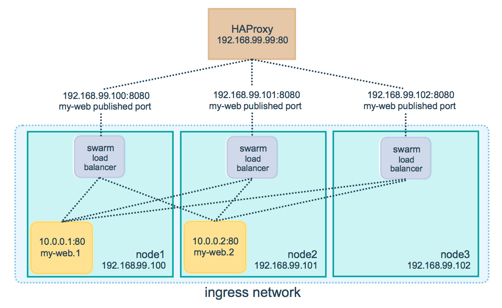
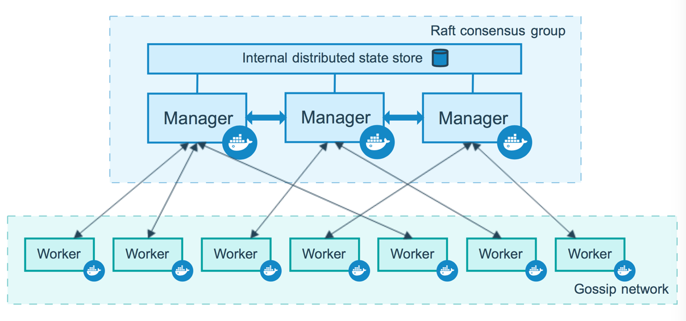
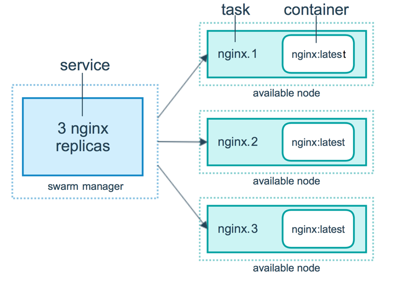
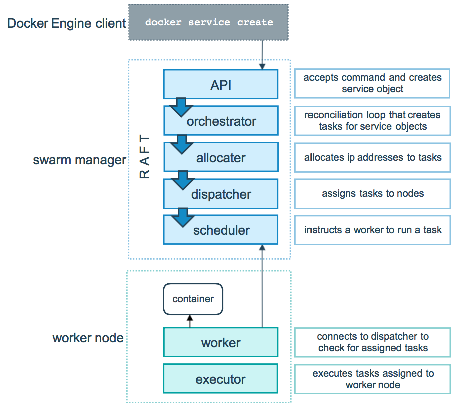
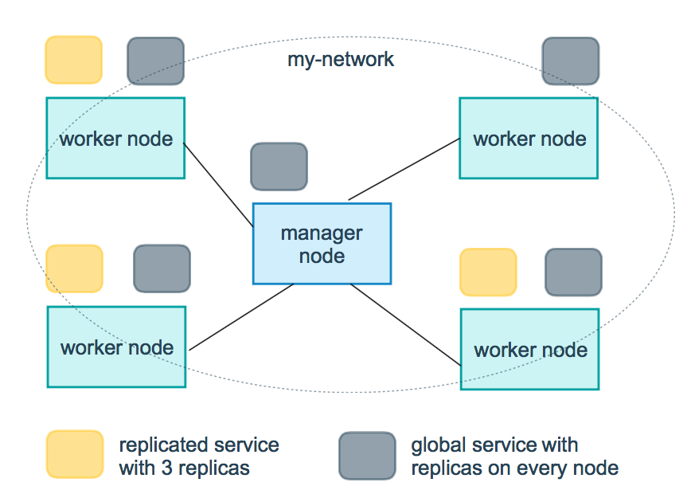
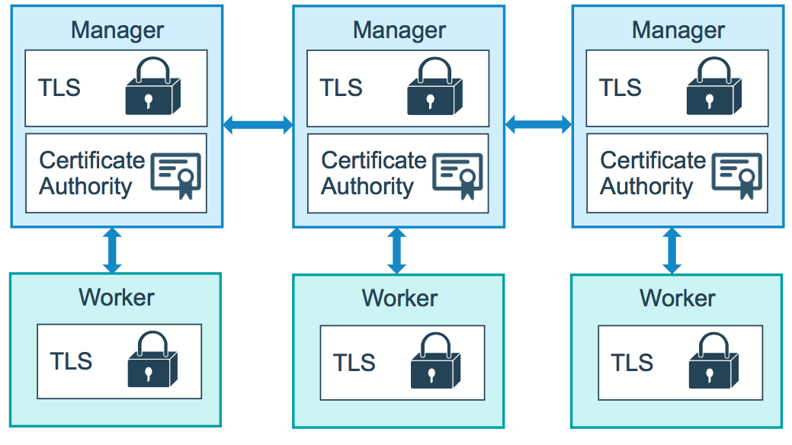

## Swarm模式

### 概述
要在群集模式下使用Docker，请安装Docker。请参阅 所有操作系统和平台的安装说明。

当前版本的Docker包括swarm模式，用于本地管理称为swarm的Docker引擎集群。使用Docker CLI创建一个swarm，将应用程序服务部署到一个swarm，并管理swarm行为。

### 功能亮点
* 集群管理与Docker Engine集成：使用Docker Engine CLI创建一大堆Docker引擎，可以在其中部署应用程序服务。无需其他编排软件即可创建或管理群组。

* 分散式设计： Docker Engine不是在部署时处理节点角色之间的区别，而是在运行时处理任何特化。可以使用Docker Engine部署两种节点，管理器和工作器。这意味着可以从单个磁盘映像构建整个swarm。

* 声明性服务模型： Docker Engine使用声明性方法来定义应用程序堆栈中各种服务的所需状态。例如，可能会描述一个由带有消息队列服务的Web前端服务和数据库后端组成的应用程序。

* 缩放：对于每个服务，可以声明要运行的任务数。当向上或向下扩展时，群集管理器会通过添加或删除任务来自动调整以维持所需的状态。

* 期望的状态协调：群集管理器节点持续监视群集状态，并协调实际状态与表达的所需状态之间的任何差异。例如，如果设置服务以运行容器的10个副本，并且托管其中两个副本的工作计算机崩溃，则管理器将创建两个新副本以替换崩溃的副本。群集管理器将新副本分配给正在运行且可用的工作线程。

* 多主机网络：可以为服务指定覆盖网络。群集管理器在初始化或更新应用程序时自动为覆盖网络上的容器分配地址。

* 服务发现： Swarm管理器节点为swarm中的每个服务分配一个唯一的DNS名称，并负载平衡正在运行的容器。可以通过嵌入在swarm中的DNS服务器查询swarm中运行的每个容器。

* 负载平衡：可以将服务端口公开给外部负载平衡器。在内部，swarm允许指定如何在节点之间分发服务容器。

* 默认情况下是安全的：群中的每个节点都强制执行TLS相互身份验证和加密，以保护自身与所有其他节点之间的通信。可以选择使用自签名根证书或自定义根CA的证书。

* 滚动更新：在启动时，可以逐步将服务更新应用于节点。通过swarm管理器，可以控制服务部署到不同节点集之间的延迟。如果出现任何问题，可以将任务回滚到以前版本的服务。
 
### Swarm模式的关键概念

####  什么是集群？
在Docker Engine中的集群管理和业务流程功能是使用[swarmkit](https://github.com/docker/swarmkit/)构建的。Swarmkit是一个单独的项目，它实现了Docker的业务流程层，并直接在Docker中使用。

一个群由多个Docker主机组成，这些主机以群集模式运行，并充当管理员（管理成员资格和委托）和工作人员（运行 [群集服务](https://docs.docker.com/engine/swarm/key-concepts/#services-and-tasks)）。给定的Docker主机可以是管理器，工作者或执行这两种角色。创建服务时，可以定义其最佳状态（可用的副本数量，网络和存储资源，服务暴露给外部世界的端口等）。Docker努力维持所需的状态。例如，如果工作节点变得不可用，Docker会在其他节点上调度该节点的任务。一个任务 是运行的容器是一个群服务的一部分，并通过群经理管理，而不是一个独立的容器。

群集服务相对于独立容器的关键优势之一是可以修改服务的配置，包括其连接的网络和卷，而无需手动重新启动服务。Docker将更新配置，使用过时配置停止服务任务，并创建与所需配置匹配的新任务。

当Docker以群集模式运行时，仍然可以在参与群组的任何Docker主机上运行独立容器，以及群集服务。独立容器和群集服务之间的关键区别在于，只有群集管理器可以管理群集，而独立容器可以在任何守护程序上启动。Docker守护程序可以作为管理员，工作人员或两者参与。

与使用Docker Compose定义和运行容器的方式相同，可以定义和运行swarm服务 堆栈。

继续阅读有关Docker swarm服务相关概念的详细信息，包括节点，服务，任务和负载平衡。

#### 节点
一个节点是docker参与集群的一个实例。还可以将其视为Docker节点。可以在单个物理计算机或云服务器上运行一个或多个节点，但生产群部署通常包括分布在多个物理和云计算机上的Docker节点。

要将应用程序部署到swarm，请将服务定义提交给 管理器节点。管理器节点将称为任务的工作单元分派 给工作节点。

Manager节点还执行维护所需群集状态所需的编排和集群管理功能。Manager节点选择单个领导者来执行编排任务。

工作节点接收并执行从管理器节点调度的任务。默认情况下，管理器节点还将服务作为工作节点运行，但可以将它们配置为仅运行管理器任务并且是仅管理器节点。代理程序在每个工作程序节点上运行，并报告分配给它的任务。工作节点向管理器节点通知其分配的任务的当前状态，以便管理器可以维持每个工作者的期望状态。

#### 服务和任务
一个服务是任务的定义，经理或工作节点上执行。它是集群系统的中心结构，是用户与集群交互的主要根源。

创建服务时，可以指定要使用的容器映像以及在运行容器中执行的命令。

在复制服务模型中，群集管理器根据在所需状态中设置的比例在节点之间分配特定数量的副本任务。

对于全局服务，swarm在集群中的每个可用节点上为服务运行一个任务。

甲任务携带多克尔容器和在容器内部运行的命令。它是集群的原子调度单元。Manager节点根据服务规模中设置的副本数量将任务分配给工作节点。将任务分配给节点后，它无法移动到另一个节点。它只能在指定的节点上运行或失败。

#### 负载均衡
群集管理器使用入口负载平衡来公开希望在群集外部提供的服务。群集管理器可以自动为PublishedPort分配服务，也可以为服务配置PublishedPort。可以指定任何未使用的端口。如果未指定端口，则swarm管理器会为服务分配30000-32767范围内的端口。

外部组件（例如云负载平衡器）可以访问群集中任何节点的PublishedPort上的服务，无论该节点当前是否正在运行该服务的任务。群集中的所有节点都将入口连接到正在运行的任务实例。

Swarm模式有一个内部DNS组件，可以自动为swarm中的每个服务分配一个DNS条目。群集管理器使用内部负载平衡来根据服务的DNS名称在群集内的服务之间分发请求。

### swarm模式搭建
#### 先决条件
参考04创建三个主机，并构建swarm主机

#### 部署服务

打开终端并将ssh导入运行管理器节点的计算机。例如，本教程使用名为的机器manager。

运行以下命令：
```
docker service create --replicas 1 --name helloworld alpine ping docker.com
twpdz6atefzf22mzhzm5gn3u6
overall progress: 1 out of 1 tasks
1/1: running   [==================================================>]
verify: Service converged
```
该docker service create命令创建服务。
该--name标志命名该服​​务helloworld。
该--replicas标志指定1个正在运行的实例的所需状态。
参数alpine ping docker.com将服务定义为执行命令的Alpine Linux容器ping docker.com。

运行docker service ls以查看正在运行的服务列表：
```
$ docker service ls
ID                  NAME                MODE                REPLICAS            IMAGE               PORTS
twpdz6atefzf        helloworld          replicated          1/1                 alpine:latest
```
运行docker service ps helloworld查看集群几点分部，该服务运行在myvm1节点
```
docker service ps helloworld
ID                  NAME                IMAGE               NODE                DESIRED STATE       CURRENT STATE           ERROR               PORTS
7qv45vsc7uso        helloworld.1        alpine:latest       myvm1               Running             Running 5 minutes ago
```

#### 查看集群服务具体信息
1. 运行docker service inspect --pretty <SERVICE-ID>以易于阅读的格式显示有关服务的详细信息。

要查看helloworld服务的详细信息：
```
docker service inspect --pretty helloworld

ID:		twpdz6atefzf22mzhzm5gn3u6
Name:		helloworld
Service Mode:	Replicated
 Replicas:	1
Placement:
UpdateConfig:
 Parallelism:	1
 On failure:	pause
 Monitoring Period: 5s
 Max failure ratio: 0
 Update order:      stop-first
RollbackConfig:
 Parallelism:	1
 On failure:	pause
 Monitoring Period: 5s
 Max failure ratio: 0
 Rollback order:    stop-first
ContainerSpec:
 Image:		alpine:latest@sha256:6a92cd1fcdc8d8cdec60f33dda4db2cb1fcdcacf3410a8e05b3741f44a9b5998
 Args:		ping docker.com
 Init:		false
Resources:
Endpoint Mode:	vip
```
> 提示：要以json格式返回服务详细信息，请运行不带--pretty标志的相同命令。

2. 运行docker service ps <SERVICE-ID>以查看正在运行服务的节点：
```
[manager1]$ docker service ps helloworld

NAME                                    IMAGE   NODE     DESIRED STATE  CURRENT STATE           ERROR               PORTS
helloworld.1.8p1vev3fq5zm0mi8g0as41w35  alpine  worker2  Running        Running 3 minutes
```
在这种情况下，服务的一个实例helloworld正在worker2节点上运行 。可能会在管理器节点上看到该服务正在运行。默认情况下，群中的管理器节点可以像工作节点一样执行任务。

Swarm还会显示服务任务DESIRED STATE和CURRENT STATE服务任务，以便可以根据服务定义查看任务是否正在运行。

3. 在运行docker ps任务的节点上运行，以查看有关该任务的容器的详细信息。

提示：如果helloworld正在管理器节点以外的节点上运行，则必须ssh到该节点。
```
[worker2]$docker ps

CONTAINER ID        IMAGE               COMMAND             CREATED             STATUS              PORTS               NAMES
e609dde94e47        alpine:latest       "ping docker.com"   3 minutes ago       Up 3 minutes                            helloworld.1.8p1vev3fq5zm0mi8g0as41w35
```

#### 在swarm中扩展服务
一旦你已经部署了服务的集群，你就可以使用swarm规模在服务容器的数量。在服务中运行的容器称为“任务”。

1. 运行以下命令以更改在swarm中运行的服务的所需状态：
```
$ docker service scale <SERVICE-ID>=<NUMBER-OF-TASKS>
```
例如：
```
$ docker service scale helloworld=5
helloworld scaled to 5
overall progress: 5 out of 5 tasks
1/5: running   [==================================================>]
2/5: running   [==================================================>]
3/5: running   [==================================================>]
4/5: running   [==================================================>]
5/5: running   [==================================================>]
verify: Service converged
```
运行docker service ps <SERVICE-ID>以查看更新的任务列表：
```
$ docker service ps helloworld

ID                  NAME                IMAGE               NODE                DESIRED STATE       CURRENT STATE            ERROR               PORTS
7qv45vsc7uso        helloworld.1        alpine:latest       myvm1               Running             Running 16 minutes ago
73vce2nj39uk        helloworld.2        alpine:latest       manager             Running             Running 27 seconds ago
sxug90vvmaqx        helloworld.3        alpine:latest       myvm2               Running             Running 27 seconds ago
x8r2s9mff7jo        helloworld.4        alpine:latest       myvm2               Running             Running 27 seconds ago
ngcldct0rtol        helloworld.5        alpine:latest       myvm1               Running             Running 39 seconds ago
```
可以看到swarm创建了4个新任务，可以扩展到总共5个正在运行的Alpine Linux实例。任务分布在群的三个节点之间。一个正在运行manager。

运行docker ps以查看在连接的节点上运行的容器。以下示例显示了正在运行的任务manager：
```
$ docker ps

CONTAINER ID        IMAGE               COMMAND             CREATED              STATUS              PORTS               NAMES
dd0019e62df7        alpine:latest       "ping docker.com"   About a minute ago   Up About a minute                       helloworld.2.73vce2nj39ukxz4e6zfqcfeuo
```
如果要查看在其他节点上运行的容器，请ssh到这些节点并运行该docker ps命令。

#### 删除swarm上运行的服务

·。 运行docker service rm helloworld以删除该helloworld服务。
```
$ docker service rm helloworld

helloworld
```
运行docker service inspect <SERVICE-ID>以验证swarm管理器是否已删除该服务。CLI返回未找到服务的消息：
```
$ docker service inspect helloworld
[]
Error: no such service: helloworld
```
即使该服务不再存在，任务容器也需要几秒钟来清理。可以docker ps在节点上使用以验证何时删除了任务。
```
$ docker ps

    CONTAINER ID        IMAGE               COMMAND                  CREATED             STATUS              PORTS               NAMES
    db1651f50347        alpine:latest       "ping docker.com"        44 minutes ago      Up 46 seconds                           helloworld.5.9lkmos2beppihw95vdwxy1j3w
    43bf6e532a92        alpine:latest       "ping docker.com"        44 minutes ago      Up 46 seconds                           helloworld.3.a71i8rp6fua79ad43ycocl4t2
    5a0fb65d8fa7        alpine:latest       "ping docker.com"        44 minutes ago      Up 45 seconds                           helloworld.2.2jpgensh7d935qdc857pxulfr
    afb0ba67076f        alpine:latest       "ping docker.com"        44 minutes ago      Up 46 seconds                           helloworld.4.1c47o7tluz7drve4vkm2m5olx
    688172d3bfaa        alpine:latest       "ping docker.com"        45 minutes ago      Up About a minute                       helloworld.1.74nbhb3fhud8jfrhigd7s29we

$ docker ps
   CONTAINER ID        IMAGE               COMMAND             CREATED             STATUS              PORTS               
```

#### 将滚动更新应用于服务
在本教程的这一部分中，将部署基于Redis 3.0.6容器标记的服务。然后升级服务以使用滚动更新来使用Redis 3.0.7容器映像。

1. 将Redis标记部署到swarm并使用10秒更新延迟配置swarm。请注意，以下示例显示了较旧的Redis标记：
```
$ docker service create \
  --replicas 3 \
  --name redis \
  --update-delay 10s \
  redis:3.0.6

verify: Service converged
```
2. 可以在服务部署时配置滚动更新策略。

该 **--update-delay**标志配置服务任务或任务集的更新之间的时间延迟。可以将时间描述T为秒数Ts，分钟数Tm或小时数的组合Th。所以 10m30s表示延迟10分30秒。

默认情况下，调度程序一次更新1个任务。可以传递该 **--update-parallelism**标志以配置调度程序同时更新的最大服务任务数。

默认情况下，当对单个任务的更新返回状态时 RUNNING，调度程序会安排另一个任务进行更新，直到所有任务都更新为止。如果在更新任务期间的任何时间返回FAILED，则调度程序会暂停更新。可以使用或 **--update-failure-action**标志来控制行为 。

    docker service create 或 docker service update

3. 检查redis服务：
```
$ docker service inspect --pretty redis

ID:		4es7nc1itjpfj9ya2sri55ffo
Name:		redis
Service Mode:	Replicated
 Replicas:	3
Placement:
UpdateConfig:
 Parallelism:	1
 Delay:		10s
 On failure:	pause
 Monitoring Period: 5s
 Max failure ratio: 0
 Update order:      stop-first
RollbackConfig:
 Parallelism:	1
 On failure:	pause
 Monitoring Period: 5s
 Max failure ratio: 0
 Rollback order:    stop-first
ContainerSpec:
 Image:		redis:3.0.6@sha256:6a692a76c2081888b589e26e6ec835743119fe453d67ecf03df7de5b73d69842
 Init:		false
Resources:
Endpoint Mode:	vip
```
4. 现在，可以更新容器图像redis。群集管理器根据UpdateConfig策略将更新应用于节点：
```
$ docker service update --image redis:3.0.7 redis
redis
```
调度程序默认情况下应用滚动更新，如下所示：

* 停止第一个任务。
* 安排已停止任务的更新。
* 启动容器以获取更新的任务。
* 如果对任务的更新返回RUNNING，请等待指定的延迟时间，然后开始下一个任务。
* 如果在更新期间的任何时间返回任务FAILED，请暂停更新。

```
 ~  docker service ls
ID                  NAME                MODE                REPLICAS            IMAGE               PORTS
4es7nc1itjpf        redis               replicated          3/3                 redis:3.0.7
 ~  docker service ls
ID                  NAME                MODE                REPLICAS            IMAGE               PORTS
4es7nc1itjpf        redis               replicated          2/3                 redis:3.0.7

 ~  docker service ps redis
ID                  NAME                IMAGE               NODE                DESIRED STATE       CURRENT STATE                 ERROR               PORTS
rz3gf0m15lzf        redis.1             redis:3.0.7         manager             Running             Running about a minute ago
vauvombdmrli         \_ redis.1         redis:3.0.6         manager             Shutdown            Shutdown 2 minutes ago
643udybqr7so        redis.2             redis:3.0.7         myvm1               Running             Preparing 28 seconds ago
iqsqqskyhnr8         \_ redis.2         redis:3.0.6         myvm1               Shutdown            Shutdown 27 seconds ago
dti99kzuby4r        redis.3             redis:3.0.7         myvm2               Running             Running 38 seconds ago
vouijvhvvr9j         \_ redis.3         redis:3.0.6         myvm2               Shutdown            Shutdown about a minute ago
```
整个过程中我们会发现Preparing时间比较长，因此在实际部署过程之前，我们应该将image拉取，再进行滚动更新

5. 运行docker service inspect --pretty redis以查看所需状态的新图像：
```

ID:		4es7nc1itjpfj9ya2sri55ffo
Name:		redis
Service Mode:	Replicated
 Replicas:	3
UpdateStatus:
 State:		updating
 Started:	27 seconds ago
 Message:	update in progress
Placement:
UpdateConfig:
 Parallelism:	1
 Delay:		10s
 On failure:	pause
 Monitoring Period: 5s
 Max failure ratio: 0
 Update order:      stop-first
RollbackConfig:
 Parallelism:	1
 On failure:	pause
 Monitoring Period: 5s
 Max failure ratio: 0
 Rollback order:    stop-first
ContainerSpec:
 Image:		redis:3.0.6@sha256:6a692a76c2081888b589e26e6ec835743119fe453d67ecf03df7de5b73d69842
 Init:		false
Resources:
Endpoint Mode:	vip
```
6. 重新启动暂停的更新运行docker service update <SERVICE-ID>。例如：
```
docker service update redis
```
为避免重复某些更新失败，可能需要通过传递标志来重新配置服务docker service update。

运行docker service ps <SERVICE-ID>以观看滚动更新：
```
$ docker service ps redis

NAME                                   IMAGE        NODE       DESIRED STATE  CURRENT STATE            ERROR
redis.1.dos1zffgeofhagnve8w864fco      redis:3.0.7  worker1    Running        Running 37 seconds
 \_ redis.1.88rdo6pa52ki8oqx6dogf04fh  redis:3.0.6  worker2    Shutdown       Shutdown 56 seconds ago
redis.2.9l3i4j85517skba5o7tn5m8g0      redis:3.0.7  worker2    Running        Running About a minute
 \_ redis.2.66k185wilg8ele7ntu8f6nj6i  redis:3.0.6  worker1    Shutdown       Shutdown 2 minutes ago
redis.3.egiuiqpzrdbxks3wxgn8qib1g      redis:3.0.7  worker1    Running        Running 48 seconds
 \_ redis.3.ctzktfddb2tepkr45qcmqln04  redis:3.0.6  mmanager1  Shutdown       Shutdown 2 minutes ago
```
在Swarm更新所有任务之前，可以看到有些正在运行 redis:3.0.6而其他任务正在运行redis:3.0.7。上面的输出显示滚动更新完成后的状态。

#### 排空群上的节点
所有节点都在运行时具有ACTIVE 可用性。群集管理器可以将任务分配给任何ACTIVE节点，因此到目前为止，所有节点都可用于接收任务。

有时，例如计划的维护时间，需要将节点设置为DRAIN 可用性。DRAIN可用性阻止节点从群集管理器接收新任务。它还意味着管理器停止在节点上运行的任务，并在具有ACTIVE可用性的节点上启动副本任务。

> 重要提示：设置一个节点，DRAIN不会删除从该节点独立的容器，如那些具有创建docker run，docker-compose up或swarm引擎API。节点的状态（包括DRAIN）仅影响节点调度swarm服务工作负载的能力。

1. 验证所有节点是否都可用。
```
$ docker node ls

 docker node ls
ID                            HOSTNAME            STATUS              AVAILABILITY        MANAGER STATUS      ENGINE VERSION
qlbgw0g4w4iwon89bvz4ktrrw *   manager             Ready               Active              Leader              18.09.7
z6ju1d6zpvayt88lcfw388fwg     myvm1               Ready               Active                                  18.09.7
x6z58d35vgmrf4b90s2wdhlzc     myvm2               Ready               Active                                  18.09.7
```
2. 如果还没有redis从滚动更新教程运行该服务，请立即启动它：
```
$ docker service create --replicas 3 --name redis --update-delay 10s redis:3.0.6

c5uo6kdmzpon37mgj9mwglcfw
```
3. 运行docker service ps redis以查看swarm管理器如何将任务分配给不同的节点：
```
$ docker service ps  --filter  "DESIRED-STATE"=Running redis
ID                  NAME                IMAGE               NODE                DESIRED STATE       CURRENT STATE            ERROR               PORTS
9on0x5vy3pzk        redis.1             redis:3.0.7         myvm1               Running             Running 12 minutes ago
mhn2x4ltyloy        redis.2             redis:3.0.7         myvm2               Running             Running 12 minutes ago
wtg8zzyo1qiu        redis.3             redis:3.0.7         manager             Running             Running 12 minutes ago
```
在这种情况下，群集管理器将一个任务分配给每个节点。可能会看到环境中的节点之间的任务分布不同。

4. 运行docker node update --availability drain <NODE-ID>以排空已分配任务的节点：
```
docker node update --availability drain myvm2
myvm2
```
检查节点以检查其可用性：
```
docker node ls
ID                            HOSTNAME            STATUS              AVAILABILITY        MANAGER STATUS      ENGINE VERSION
qlbgw0g4w4iwon89bvz4ktrrw *   manager             Ready               Active              Leader              18.09.7
z6ju1d6zpvayt88lcfw388fwg     myvm1               Ready               Active                                  18.09.7
x6z58d35vgmrf4b90s2wdhlzc     myvm2               Ready               Drain                                   18.09.7


$ docker node inspect --pretty myvm2
ID:			x6z58d35vgmrf4b90s2wdhlzc
Hostname:              	myvm2
Joined at:             	2019-07-12 03:41:18.689173183 +0000 utc
Status:
 State:			Ready
 Availability:         	Drain
 Address:		192.168.99.106
Platform:
 Operating System:	linux
 Architecture:		x86_64
Resources:
 CPUs:			1
 Memory:		989.4MiB
Plugins:
 Log:		awslogs, fluentd, gcplogs, gelf, journald, json-file, local, logentries, splunk, syslog
 Network:		bridge, host, macvlan, null, overlay
 Volume:		local
Engine Version:		18.09.7
Engine Labels:
 - provider=virtualbox
TLS Info:
 TrustRoot:

```
排出的节点显示Drain为AVAILABILITY。

5. 运行docker service ps redis以查看swarm管理器如何更新服务的任务分配redis：

$ docker service ps redis
```
docker service ps  --filter  "DESIRED-STATE"=Running redis
ID                  NAME                IMAGE               NODE                DESIRED STATE       CURRENT STATE                ERROR               PORTS
9on0x5vy3pzk        redis.1             redis:3.0.7         myvm1               Running             Running 15 minutes ago
oyj58jqx7tlm        redis.2             redis:3.0.7         manager             Running             Running about a minute ago
wtg8zzyo1qiu        redis.3             redis:3.0.7         manager             Running             Running 16 minutes ago
```

myvm2上的任务转移到了manager上，群集管理器通过在具有Drain可用性的节点上结束任务并在具有可用性的节点上创建新任务来维持期望的状态Active 。

6. 运行 docker node update --availability active <NODE-ID>以将耗尽的节点返回到活动状态：
```
$ docker node update --availability active myvm2

myvm2
```
检查节点以查看更新的状态：
```
$ docker node inspect --pretty myvm2

...
Status:
 State:			Ready
 Availability:         	Active
 Address:		192.168.99.106
...snip...
```
此时查看集群状态
```
docker service ps  --filter  "DESIRED-STATE"=Running redis
ID                  NAME                IMAGE               NODE                DESIRED STATE       CURRENT STATE            ERROR               PORTS
9on0x5vy3pzk        redis.1             redis:3.0.7         myvm1               Running             Running 19 minutes ago
oyj58jqx7tlm        redis.2             redis:3.0.7         manager             Running             Running 5 minutes ago
wtg8zzyo1qiu        redis.3             redis:3.0.7         manager             Running             Running 19 minutes ago
```
myvm2并没有任务执行。
将节点设置回Active可用性时，它可以接收新任务：

* 在服务更新期间扩大规模
* 在滚动更新期间
* 当将另一个节点设置为Drain可用性时
* 当任务在另一个活动节点上失败时

#### 使用swarm模式路由网格
Docker Engine群集模式可以轻松发布服务端口，使其可用于群外的资源。所有节点都参与入口路由网格。路由网格使群集中的每个节点都能够接受已发布端口上的连接，以便在群集中运行任何服务，即使节点上没有任何任务正在运行。路由网格将所有传入请求路由到可用节点上的已发布端口到活动容器。

要在群集中使用入口网络，需要在启用群集模式之前在群集节点之间打开以下端口：

* 7946用于容器网络发现的端口TCP / UDP。
* 4789容器入口网络的端口UDP。
还必须打开群集节点与需要访问端口的任何外部资源（如外部负载平衡器）之间的已发布端口。

还可以绕过给定服务的路由网格。

##### 发布服务端口
使用该--publish标志在创建服务时发布端口。target 用于指定容器内的端口，published用于指定要在路由网格上绑定的端口。如果离开published 端口，则会为每个服务任务绑定一个随机的高编号端口。需要检查任务以确定端口。
```
$ docker service create \
  --name <SERVICE-NAME> \
  --publish published=<PUBLISHED-PORT>,target=<CONTAINER-PORT> \
  <IMAGE>
  ```
注意：此语法的旧形式是冒号分隔的字符串，其中发布的端口是第一个，目标端口是第二个，例如 -p 8080:80。新语法是首选，因为它更易于阅读并允许更大的灵活性。

这<PUBLISHED-PORT>是swarm提供服务的端口。如果省略它，则绑定一个随机的高编号端口。它<CONTAINER-PORT>是容器侦听的端口。此参数是必需的。

例如，以下命令将nginx容器中的端口80发布到群集中任何节点的端口8080：
```
$ docker service create \
  --name my-web \
  --publish published=8080,target=80 \
  --replicas 2 \
  nginx
  ```
当在任何节点上访问端口8080时，Docker会将请求路由到活动容器。在群集节点本身上，端口8080实际上可能没有绑定，但路由网格知道如何路由流量并防止发生任何端口冲突。

路由网格在已发布的端口上侦听分配给该节点的任何IP地址。对于可外部路由的IP地址，该端口可从主机外部获得。对于所有其他IP地址，只能从主机内访问。


可以使用以下命令发布现有服务的端口：
```
$ docker service update \
  --publish-add published=<PUBLISHED-PORT>,target=<CONTAINER-PORT> \
  <SERVICE>
```
可以使用docker service inspect查看服务的已发布端口。例如：
```
$ docker service inspect --format="{{json .Endpoint.Spec.Ports}}" my-web

[{"Protocol":"tcp","TargetPort":80,"PublishedPort":8080}]
```
输出显示<CONTAINER-PORT>（标记为TargetPort从容器）和 <PUBLISHED-PORT>（标记PublishedPort），其中节点监听的服务请求。

##### 仅为TCP或仅UDP发布端口
默认情况下，发布端口时，它是TCP端口。除了TCP端口之外，还可以专门发布UDP端口。发布TCP和UDP端口时，如果省略协议说明符，则端口将作为TCP端口发布。如果使用较长的语法（建议用于Docker 1.13及更高版本），请将protocol密钥设置为tcp或udp。

仅限TCP
语法长：
```
$ docker service create --name dns-cache \
  --publish published=53,target=53 \
  dns-cache
  ```
语法短：
```
$ docker service create --name dns-cache \
  -p 53:53 \
  dns-cache
```
TCP和UDP
语法长：
```
$ docker service create --name dns-cache \
  --publish published=53,target=53 \
  --publish published=53,target=53,protocol=udp \
  dns-cache
```
语法短：
```
$ docker service create --name dns-cache \
  -p 53:53 \
  -p 53:53/udp \
  dns-cache
```
仅限UDP
语法长：
```
$ docker service create --name dns-cache \
  --publish published=53,target=53,protocol=udp \
  dns-cache
```
语法短：
```
$ docker service create --name dns-cache \
  -p 53:53/udp \
  dns-cache
```
##### 绕过路由网格
可以绕过路由网格，以便在访问给定节点上的绑定端口时，始终访问在该节点上运行的服务实例。这被称为host模式。有几点需要牢记。

如果访问未运行服务任务的节点，则该服务不会侦听该端口。可能没有任何内容正在侦听，或者完全不同的应用程序正在侦听。

如果希望在每个节点上运行多个服务任务（例如，当有5个节点但运行10个副本时），则无法指定静态目标端口。允许Docker分配一个随机的高编号端口（通过不离开 published），或者确保只有一个服务实例在给定节点上运行，使用全局服务而不是复制服务，或者使用放置约束。

要绕过路由网格，必须使用长--publish服务并设置mode为host。如果省略该mode键或将其设置为ingress，则使用路由网格。以下命令使用host模式创建全局服务 并绕过路由网格。
```
$ docker service create --name dns-cache \
  --publish published=53,target=53,protocol=udp,mode=host \
  --mode global \
  dns-cache
```
##### 配置外部负载均衡器
可以为群组服务配置外部负载平衡器，可以与路由网格结合使用，也可以根本不使用路由网格。

###### 使用路由网格
可以配置外部负载平衡器以将请求路由到群组服务。例如，可以配置HAProxy以平衡对发布到端口8080的nginx服务的请求。


在这种情况下，端口8080必须在负载平衡器和群集中的节点之间打开。群集节点可以驻留在代理服务器可访问的专用网络上，但不可公开访问。

可以配置负载平衡器以平衡群中每个节点之间的请求，即使节点上没有安排任务也是如此。例如，可以在以下位置进行以下HAProxy配置/etc/haproxy/haproxy.cfg：
```
global
        log /dev/log    local0
        log /dev/log    local1 notice
...snip...

# Configure HAProxy to listen on port 80
frontend http_front
   bind *:80
   stats uri /haproxy?stats
   default_backend http_back

# Configure HAProxy to route requests to swarm nodes on port 8080
backend http_back
   balance roundrobin
   server node1 192.168.99.100:8080 check
   server node2 192.168.99.101:8080 check
   server node3 192.168.99.102:8080 check
```
当在端口80上访问HAProxy负载均衡器时，它会将请求转发给群中的节点。swarm路由网格将请求路由到活动任务。如果由于任何原因，swarm调度程序将任务分派给不同的节点，则无需重新配置负载均衡器。

可以配置任何类型的负载均衡器以将请求路由到群集节点。要了解有关HAProxy的更多信息，请参阅HAProxy文档。

###### 没有路由网格
要使用不带路由网格的外部负载平衡器，请设置--endpoint-mode 为dnsrr而不是默认值vip。在这种情况下，没有一个虚拟IP。相反，Docker为服务设置DNS条目，以便服务名称的DNS查询返回IP地址列表，客户端直接连接到其中一个。有责任向负载均衡器提供IP地址和端口列表。

### swarm集群工作原理
#### 节点如何工作

Docker Engine 1.12引入了swarm模式，使可以创建一个名为swarm的一个或多个Docker引擎的集群。群由一个或多个节点组成：在群集模式下运行Docker Engine 1.12或更高版本的物理或虚拟机。

有两种类型的节点：管理 和 工人。




如果还没有，请阅读 前面的swarm模式概述和关键概念。

##### 管理节点
Manager节点处理集群管理任务：

* 维护集群状态
* 调度服务
* 提供swarm模式HTTP API端点
使用Raft实现，管理器维护整个swarm的一致内部状态以及在其上运行的所有服务。出于测试目的，可以使用单个管理器运行swarm。如果单管理器群中的管理器发生故障，服务将继续运行，但需要创建一个新的群集才能恢复。

为了利用swarm模式的容错功能，Docker建议根据组织的高可用性要求实现奇数个节点。当有多个管理器时，可以从管理器节点的故障中恢复而无需停机。

* 一个三管理员群可以容忍一个管理员的最大损失。
* 五管理器群可以容忍两个管理器节点的最大同时丢失。
* 一个N经理集群容忍最多损失 (N-1)/2经理。
Docker建议最多七个管理器节点用于一个群。

> 重要说明：添加更多管理器并不意味着可扩展性更高或性能更高。一般而言，情况正好相反。

##### 工人节点
Worker节点也是Docker Engine的实例，其唯一目的是执行容器。工作节点不参与Raft分布状态，制定调度决策或提供群模式HTTP API。

可以创建一个管理器节点的群集，但是如果没有至少一个管理器节点，则不能拥有工作节点。默认情况下，所有经理都是工人。在单个管理器节点集群中，可以运行类似docker service create的命令，并且调度程序将所有任务放在本地Engine上。

要防止调度程序将任务放在多节点群集中的管理器节点上，请将管理器节点的可用性设置为Drain。调度程序在Drain模式下优雅地停止节点上的任务，并在节点上调度任务 Active。调度程序不会将新任务分配给具有Drain 可用性的节点。

请参阅docker node update 命令行参考以了解如何更改节点可用性。

改变角色
可以通过运行将工作节点提升为经理docker node promote。
```
提升为管理
docker node promote NODE_NAME
降级为工人
docker node demote NODE_NAME
```

#### 服务如何运作
要在Docker Engine处于群集模式时部署应用程序映像，需要创建服务。服务通常是一些较大应用程序环境中微服务的映像。服务示例可能包括HTTP服务器，数据库或希望在分布式环境中运行的任何其他类型的可执行程序。

创建服务时，可以指定要使用的容器映像以及在运行容器中执行的命令。还可以定义服务的选项，包括：

* 群集在群组外部提供服务的端口
* 服务的覆盖网络，以连接到群中的其他服务
* CPU和内存限制和预留
* 滚动更新政策
* 要在群中运行的图像的副本数

##### 服务，任务和容器
当将服务部署到swarm时，swarm管理器会将服务定义接受为服务的所需状态。然后，它将群中节点上的服务调度为一个或多个副本任务。任务在群集中的节点上彼此独立地运行。

例如，假设想要在HTTP侦听器的三个实例之间进行负载平衡。下图显示了具有三个副本的HTTP侦听器服务。监听器的三个实例中的每一个都是群中的任务。



容器是一个孤立的过程。在群模式模型中，每个任务只调用一个容器。任务类似于调度程序放置容器的“槽”。一旦容器处于活动状态，调度程序就会识别出该任务处于运行状态。如果容器未通过运行状况检查或终止，则任务将终止。

##### 任务和日程安排
任务是群内调度的原子单位。通过创建或更新服务声明所需的服务状态时，协调器通过调度任务来实现所需的状态。例如，定义了一个服务，该服务指示协调器始终保持三个HTTP侦听器实例的运行。协调器通过创建三个任务来响应。每个任务都是调度程序通过生成容器来填充的插槽。容器是任务的实例化。如果HTTP侦听器任务随后未通过其运行状况检查或崩溃，则协调器会创建一个新的副本任务，该任务会生成一个新容器。

任务是单向机制。它通过一系列状态单调地进行：分配，准备，运行等。如果任务失败，则协调器移除任务及其容器，然后根据服务指定的所需状态创建新任务以替换它。

Docker swarm模式的基础逻辑是通用调度程序和协调器。服务和任务抽象本身并不知道它们实现的容器。假设可以实现其他类型的任务，例如虚拟机任务或非容器化流程任务。调度程序和协调器与任务类型无关。但是，当前版本的Docker仅支持容器任务。

下图显示了swarm模式如何接受服务创建请求并将任务调度到工作节点。



##### 待定服务
可以以这样的方式配置服务：当前在群中的节点不能运行其任务。在这种情况下，服务保持状态pending。以下是服务可能保持状态的几个示例pending。

> 注意：如果唯一目的是阻止部署服务，请将服务扩展为0，而不是尝试以保持服务的方式对其进行配置pending。

如果所有节点都暂停或耗尽，并且创建了一个服务，则它将处于暂挂状态，直到节点可用。实际上，第一个可用的节点可以获得所有任务，因此在生产环境中这不是一件好事。

可以为服务保留特定数量的内存。如果swarm中没有节点具有所需的内存量，则服务将保持挂起状态，直到有可运行其任务的节点为止。如果指定一个非常大的值（例如500 GB），则任务将永远保持挂起状态，除非确实有一个可以满足它的节点。

可以对服务施加放置约束，并且可能无法在给定时间遵守约束。

此行为说明任务的要求和配置与群集的当前状态没有紧密联系。作为swarm的管理员，声明了swarm的所需状态，并且管理器使用swarm中的节点来创建该状态。无需对群组上的任务进行微观管理。

##### 复制和全局服务
有两种类型的服务部署，复制和全局。

对于复制服务，可以指定要运行的相同任务的数量。例如，决定部署具有三个副本的HTTP服务，每个副本提供相同的内容。

全局服务是在每个节点上运行一个任务的服务。没有预先指定的任务数量。每次向swarm添加节点时，orchestrator都会创建一个任务，并且调度程序会将任务分配给新节点。适用于全局服务的良好候选者是监视代理程序，防病毒扫描程序或希望在群集中的每个节点上运行的其他类型的容器。

下图显示了黄色的三服务副本和灰色的全局服务。



#### 使用公钥基础结构（PKI）管理群集安全性
Docker内置的swarm模式公钥基础结构（PKI）系统使得安全地部署容器编排系统变得简单。群中的节点使用相互传输层安全性（TLS）来验证，授权和加密与群中其他节点的通信。

通过运行创建swarm时docker swarm init，Docker将自己指定为管理器节点。默认情况下，管理器节点生成新的根证书颁发机构（CA）以及密钥对，用于保护与加入群集的其他节点的通信。如果愿意，可以使用docker swarm init命令的 **--external-ca**标志 指定自己的外部生成的根CA.

管理器节点还会生成两个令牌，以便在将其他节点加入群组时使用：**一个工作者令牌**和**一个管理器令牌**。每个令牌包括根CA证书的摘要和随机生成的秘密。当节点加入群集时，加入节点使用摘要来验证来自远程管理器的根CA证书。远程管理器使用密钥来确保加入节点是已批准的节点。

每次新节点加入群集时，管理器都会向节点颁发证书。证书包含随机生成的节点ID，用于标识证书公用名（CN）下的节点和组织单位（OU）下的角色。节点ID用作当前群中节点的生存期的加密安全节点标识。

下图说明了管理器节点和工作节点如何使用最少的TLS 1.2加密通信。



以下示例显示了来自工作节点的证书的信息：
```
Certificate:
    Data:
        Version: 3 (0x2)
        Serial Number:
            3b:1c:06:91:73:fb:16:ff:69:c3:f7:a2:fe:96:c1:73:e2:80:97:3b
        Signature Algorithm: ecdsa-with-SHA256
        Issuer: CN=swarm-ca
        Validity
            Not Before: Aug 30 02:39:00 2016 GMT
            Not After : Nov 28 03:39:00 2016 GMT
        Subject: O=ec2adilxf4ngv7ev8fwsi61i7, OU=swarm-worker, CN=dw02poa4vqvzxi5c10gm4pq2g
...snip...
```
默认情况下，群中的每个节点每三个月更新一次证书。可以通过运行该 **docker swarm update --cert-expiry <TIME PERIOD>** 命令来配置此间隔。最小更换值为1小时。有关详细信息，请参阅 docker swarm update CLI参考。

##### 更换CA证书
如果群集CA密钥或管理器节点受到威胁，可以更换群集根CA，以便所有节点都不再信任由旧根CA签署的证书。

运行 **docker swarm ca --rotate**以生成新的CA证书和密钥。如果愿意，可以传递 **--ca-cert**和 **--external-ca**标志以指定根证书并使用群组外部的根CA. 或者，可以传递 **--ca-cert**和 **--ca-key**标志以指定希望swarm使用的确切证书和密钥。

发出docker swarm ca --rotate命令时，按顺序执行以下操作：

1. Docker生成交叉签名证书。这意味着新的根CA证书的一个版本使用旧的根CA证书进行签名。此交叉签名证书用作所有新节点证书的中间证书。这可确保仍信任旧根CA的节点仍可验证由新CA签名的证书。

2. 在Docker 17.06及更高版本中，Docker还告诉所有节点立即更新其TLS证书。此过程可能需要几分钟，具体取决于群中的节点数。

> 注意：如果swarm具有不同Docker版本的节点，则以下两项都是正确的：
只有作为领导者运行且运行Docker 17.06或更高版本的管理员才会告知节点更新其TLS证书。
只有运行Docker 17.06或更高版本的节点才能遵守此指令。
对于最可预测的行为，请确保所有swarm节点都运行Docker 17.06或更高版本。

3.在swarm中的每个节点都有一个由新CA签名的新TLS证书后，Docker会忘记旧的CA证书和密钥材料，并告知所有节点仅信任新的CA证书。

这也会导致群组的连接令牌发生变化。以前的加入令牌不再有效。

从此时起，所有颁发的新节点证书都使用新的根CA签名，并且不包含任何中间体。

#### Swarm任务状态

Docker允许创建可以启动任务的服务。服务是对所需状态的描述，任务完成工作。按顺序在群集节点上安排工作：

使用 **docker service create**或UCP Web UI或CLI 创建服务。
1. 请求转到Docker管理器节点。
2. Docker管理器节点将服务调度为在特定节点上运行。
3. 每项服务都可以启动多项任务。
4. 每个任务都有一个生命周期，使用NEW，PENDING和COMPLETE等状态。
任务是一次运行完成的执行单元。当任务停止时，它不会再次执行，但新任务可能会取而代之。

任务通过许多州前进，直到完成或失败。任务在NEW州内初始化。任务通过许多州前进，其状态不会倒退。举例来说，任务也永远不会从去 COMPLETE到RUNNING。

任务按以下顺序遍历状态：

|任务状态|	描述|
| --- | --- |
|NEW	|任务已初始化。|
|PENDING	|分配了任务的资源。|
|ASSIGNED	|Docker将任务分配给节点。|
|ACCEPTED	|该任务被工作节点接受。如果工作节点拒绝该任务，则状态将更改为REJECTED。|
|PREPARING|	Docker正在准备这项任务。|
|STARTING|	Docker正在开始这项任务。|
|RUNNING	|任务正在执行。|
|COMPLETE|	任务退出时没有错误代码。|
|FAILED|	任务退出并显示错误代码。|
|SHUTDOWN|	Docker请求关闭任务。|
|REJECTED|	工作节点拒绝了该任务。|
|ORPHANED|	该节点停机时间过长。|
|REMOVE|	该任务不是终端，但关联的服务已被删除或缩小。|
##### 查看任务状态
运行docker service ps <service-name>以获取任务的状态。该 CURRENT STATE字段显示任务的状态以及它在那里的时间。
```
$ docker service ps webserver
ID                  NAME                IMAGE               NODE                DESIRED STATE       CURRENT STATE            ERROR                              PORTS
owsz0yp6z375        webserver.1         nginx               UbuntuVM            Running             Running 44 seconds ago
j91iahr8s74p         \_ webserver.1     nginx               UbuntuVM            Shutdown            Failed 50 seconds ago    "No such container: webserver.…"
7dyaszg13mw2         \_ webserver.1     nginx               UbuntuVM            Shutdown            Failed 5 hours ago       "No such container: webserver.…"
```