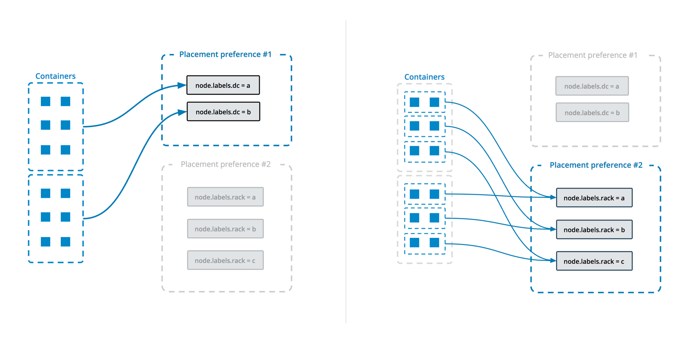

# swarm 深入学习

## 以群集模式运行Docker Engine
预计阅读时间： 8分钟
首次安装并开始使用Docker Engine时，默认情况下禁用swarm模式。启用swarm模式时，将使用通过该docker service命令管理的服务的概念。

在群集模式下运行引擎有两种方法：

* 创建一个新的swarm，在本文中介绍。
* 加入现有的集群。

在本地计算机上以群集模式运行引擎时，可以根据已创建的图像或其他可用图像创建和测试服务。在生产环境中，swarm模式提供具有集群管理功能的容错平台，以使服务保持运行和可用。

这些说明假设已在计算机上安装Docker Engine 1.12或更高版本，以充当群组中的管理器节点。


### 创建一个群
当运行命令以创建群集时，Docker Engine开始以群集模式运行。

运行docker swarm init 以在当前节点上创建单节点群。引擎按如下方式设置群：

* 将当前节点切换到群集模式。
* 创建一个名为的集群default。
* 将当前节点指定为群的领导管理器节点。
* 使用计算机主机名命名节点。
* 配置管理器以侦听端口2377上的活动网络接口。
* 将当前节点设置为Active可用性，这意味着它可以从调度程序接收任务。
* 为参与swarm的Engines启动内部分布式数据存储，以维护swarm及其上运行的所有服务的一致视图。
* 默认情况下，为swarm生成自签名根CA.
* 默认情况下，为工作站和管理器节点生成令牌以加入群。
* 创建一个以ingress发布swarm外部服务端口命名的覆盖网络。
* 为网络创建覆盖默认IP地址和子网掩码
* 输出for docker swarm init提供了在将新的工作节点加入swarm时使用的连接命令：
```
$ docker swarm init
Swarm initialized: current node (dxn1zf6l61qsb1josjja83ngz) is now a manager.

To add a worker to this swarm, run the following command:

    docker swarm join \
    --token SWMTKN-1-49nj1cmql0jkz5s954yi3oex3nedyz0fb0xx14ie39trti4wxv-8vxv8rssmk743ojnwacrr2e7c \
    192.168.99.100:2377

To add a manager to this swarm, run 'docker swarm join-token manager' and follow the instructions.
```
### 配置默认地址池
默认情况下，Docker Swarm使用默认地址池10.0.0.0/8作为全局范围（覆盖）网络。未指定子网的每个网络都将从此池顺序分配一个子网。在某些情况下，可能需要为网络使用不同的默认IP地址池。

例如，如果默认10.0.0.0/8范围与网络中已分配的地址空间冲突，则需要确保网络使用不同的范围，而不要求Swarm用户使用该--subnet命令指定每个子网。

要配置自定义默认地址池，必须使用 **--default-addr-pool**命令行选项在Swarm初始化时定义池 。此命令行选项使用CIDR表示法来定义子网掩码。要为Swarm创建自定义地址池，必须至少定义一个默认地址池和一个可选的默认地址池子网掩码。例如，对于10.0.0.0/27，使用该值27。

Docker从该 **--default-addr-pool**选项指定的地址范围中分配子网地址。例如，命令行选项 **--default-addr-pool** 10.10.0.0/16指示Docker将从该/16地址范围分配子网。如果--default-addr-pool-mask-len未指定或明确设置为24，则会产生256个/24表单网络10.10.X.0/24。

子网范围来自 **--default-addr-pool**（例如10.10.0.0/16）。16的大小表示可以在该default-addr-pool范围内创建的网络数量。该--default-address-pool选项可以多次出现，每个选项为docker提供额外的地址以用于覆盖子网。

命令格式为：
```
$ docker swarm init --default-address-pool <IP range in CIDR> [--default-address-pool <IP range in CIDR> --default-addr-pool-mask-length <CIDR value>]
```
要为10.20.0.0网络创建带/ 16（B类）的默认IP地址池，如下所示：
```
$ docker swarm init --default-addr-pool 10.20.0.0/16
```
要/16为10.20.0.0和10.30.0.0网络创建一个带有（类B）的默认IP地址池，并/26为每个网络创建一个子网掩码，如下所示：
```
$ docker swarm init --default-addr-pool 10.20.0.0/16 --default-addr-pool 10.30.0.0/16 --default-addr-pool-mask-length 26
```
在此示例中，docker network create -d overlay net1将导致10.20.0.0/26作为分配的子网net1，docker network create -d overlay net2并将导致10.20.0.64/26为其分配的子网net2。这一直持续到所有子网都耗尽为止。

有关更多信息，请参阅以下页面：

  * 有关默认地址池使用情况的更多信息，请参阅[Swarm网络](https://docs.docker.com/engine/swarm/networking/)
  * [UCP安装计划](https://docs.docker.com/ee/ucp/admin/install/plan-installation/)有关在安装之前规划网络设计的更多信息
  * docker swarm init 有关--default-address-pool标志的更多详细信息，请参阅[CLI参考](https://docs.docker.com/engine/reference/commandline/swarm_init/)

#### 配置广播地址
Manager节点使用广告地址来允许swarm中的其他节点访问Swarmkit API并覆盖网络。群集上的其他节点必须能够访问其广告地址上的管理器节点。

如果未指定广告地址，Docker将检查系统是否具有单个IP地址。如果是这样，Docker 2377默认使用IP地址和监听端口 。如果系统有多个IP地址，则必须指定正确的--advertise-addr以启用管理中间通信和覆盖网络：
```
$ docker swarm init --advertise-addr <MANAGER-IP>
```
还必须指定 **--advertise-addr**其他节点到达第一个管理器节点的地址是否与管理器看到的地址不同。例如，在跨越不同区域的云设置中，主机具有用于在区域内访问的内部地址和用于从该区域外部进行访问的外部地址。在这种情况下，请指定外部地址，**--advertise-addr**以便节点可以将该信息传播到随后连接到该节点的其他节点。

有关广告地址的更多详细信息，请参阅docker swarm init [CLI参考](https://docs.docker.com/engine/reference/commandline/swarm_init/)。

#### 查看join命令或更新swarm join标记
节点需要秘密令牌才能加入群组。工作节点的令牌与管理器节点的令牌不同。节点在加入群集时仅使用join-token。在节点已加入群集后更换连接令牌不会影响节点的群组成员资格。令牌轮换确保尝试加入群的任何新节点都不能使用旧令牌。

要检索包含工作节点的连接标记的join命令，请运行：
```
$ docker swarm join-token worker

To add a worker to this swarm, run the following command:

    docker swarm join \
    --token SWMTKN-1-49nj1cmql0jkz5s954yi3oex3nedyz0fb0xx14ie39trti4wxv-8vxv8rssmk743ojnwacrr2e7c \
    192.168.99.100:2377

This node joined a swarm as a worker.
```
要查看管理器节点的join命令和标记，请运行：
```
$ docker swarm join-token manager

To add a worker to this swarm, run the following command:

    docker swarm join \
    --token SWMTKN-1-59egwe8qangbzbqb3ryawxzk3jn97ifahlsrw01yar60pmkr90-bdjfnkcflhooyafetgjod97sz \
    192.168.99.100:2377
```
传递--quiet标志只打印令牌：
```
$ docker swarm join-token --quiet worker

SWMTKN-1-49nj1cmql0jkz5s954yi3oex3nedyz0fb0xx14ie39trti4wxv-8vxv8rssmk743ojnwacrr2e7c
```
小心连接令牌，因为它们是加入集群所必需的秘密。特别是，将秘密检入版本控制是一种不好的做法，因为它允许任何有权访问应用程序源代码的人向群添加新节点。管理器令牌特别敏感，因为它们允许新的管理器节点加入并获得对整个群的控制权。

我们建议在以下情况下更换连接令牌：

* 如果令牌被意外登记到版本控制系统，群聊或意外打印到日志。
* 如果怀疑节点已被盗用。
* 如果希望保证没有新节点可以加入群组。
此外，最佳实践是为任何秘密实施常规轮换计划，包括swarm join tokens。我们建议至少每6个月轮换一次令牌。

运行swarm join-token --rotate以使旧令牌无效并生成新令牌。指定是要更换令牌worker还是manager 节点：
```
$ docker swarm join-token  --rotate worker

To add a worker to this swarm, run the following command:

    docker swarm join \
    --token SWMTKN-1-2kscvs0zuymrsc9t0ocyy1rdns9dhaodvpl639j2bqx55uptag-ebmn5u927reawo27s3azntd44 \
    192.168.99.100:2377
```

## 将节点加入群组
首次创建群时，将单个Docker Engine置于群集模式。要充分利用swarm模式，可以向swarm添加节点：

添加工作节点会增加容量。将服务部署到swarm时，Engine会调度可用节点上的任务，无论它们是工作节点还是管理器节点。当将工作人员添加到群组中时，可以增加群组的规模来处理任务，而不会影响经理筏的共识。
Manager节点增加了容错能力。Manager节点执行swarm的编排和集群管理功能。在管理器节点中，单个领导节点执行编排任务。如果领导节点发生故障，则剩余的管理器节点将选择新的领导者并恢复群集状态的编排和维护。默认情况下，管理器节点也运行任务。
在将节点添加到群集之前，必须在主机上安装Docker Engine 1.12或更高版本。

Docker Engine根据为命令提供的join-token加入swarm docker swarm join。节点仅在加入时使用令牌。如果随后更换令牌，则不会影响现有的群集节点。请参阅以群集模式运行Docker Engine。

注意：Docker引擎允许非FIPS节点加入启用FIPS的群集群集。

虽然混合FIPS环境使升级或更改状态更容易，但Docker建议不要在生产中运行混合FIPS环境。

### 作为工作节点加入
要检索包含工作节点的连接标记的join命令，请在管理器节点上运行以下命令：
```
$ docker swarm join-token worker

To add a worker to this swarm, run the following command:

    docker swarm join \
    --token SWMTKN-1-49nj1cmql0jkz5s954yi3oex3nedyz0fb0xx14ie39trti4wxv-8vxv8rssmk743ojnwacrr2e7c \
    192.168.99.100:2377
```
从worker上的输出运行命令以加入swarm：
```
$ docker swarm join \
  --token SWMTKN-1-49nj1cmql0jkz5s954yi3oex3nedyz0fb0xx14ie39trti4wxv-8vxv8rssmk743ojnwacrr2e7c \
  192.168.99.100:2377

This node joined a swarm as a worker.
```
该docker swarm join命令执行以下操作：

* 将当前节点上的Docker Engine切换到swarm模式。
* 请求经理提供TLS证书。
* 使用计算机主机名命名节点
* 基于集群令牌将当前节点连接到管理器侦听地址处的群集。
* 将当前节点设置为Active可用性，这意味着它可以从调度程序接收任务。
* 将ingress覆盖网络扩展到当前节点。

### 加入作为经理节点
当运行docker swarm join并传递管理器令牌时，Docker Engine会切换到与工作人员相同的群集模式。经理节点也参与了筏的共识。新节点应该是Reachable，但现有经理仍然是群Leader。

Docker建议每个群集使用三个或五个管理器节点来实现高可用性。由于swarm模式管理器节点使用Raft共享数据，因此必须有奇数个管理器。只要超过一半的管理器节点的法定数量可用，群集就可以继续运行。

要检索包含管理器节点的连接标记的join命令，请在管理器节点上运行以下命令：
```
$ docker swarm join-token manager

To add a manager to this swarm, run the following command:

    docker swarm join \
    --token SWMTKN-1-61ztec5kyafptydic6jfc1i33t37flcl4nuipzcusor96k7kby-5vy9t8u35tuqm7vh67lrz9xp6 \
    192.168.99.100:2377
```
从新管理器节点上的输出运行命令以将其连接到swarm：
```
$ docker swarm join \
  --token SWMTKN-1-61ztec5kyafptydic6jfc1i33t37flcl4nuipzcusor96k7kby-5vy9t8u35tuqm7vh67lrz9xp6 \
  192.168.99.100:2377

This node joined a swarm as a manager.
```

## 管理群中的节点
作为群集管理生命周期的一部分，可能需要按如下方式查看或更新节点：

* 列出群中的节点
* 检查单个节点
* 更新节点
* 离开群

### 列表节点
要从docker node ls管理器节点查看swarm中的节点列表，请执行以下操作：
```
$ docker node ls

ID                           HOSTNAME  STATUS  AVAILABILITY  MANAGER STATUS
46aqrk4e473hjbt745z53cr3t    node-5    Ready   Active        Reachable
61pi3d91s0w3b90ijw3deeb2q    node-4    Ready   Active        Reachable
a5b2m3oghd48m8eu391pefq5u    node-3    Ready   Active
e7p8btxeu3ioshyuj6lxiv6g0    node-2    Ready   Active
ehkv3bcimagdese79dn78otj5 *  node-1    Ready   Active        Leader
```
该AVAILABILITY列显示调度程序是否可以将任务分配给节点：

* Active 表示调度程序可以将任务分配给节点。
* Pause 表示调度程序不会将新任务分配给节点，但现有任务仍在运行。
* Drain表示调度程序不会将新任务分配给节点。调度程序关闭所有现有任务并在可用节点上调度它们。

该MANAGER STATUS列显示节点参与Raft共识：

* 没有值表示不参与群组管理的工作节点。
* Leader 表示节点是主管理器节点，它为群集做出所有群集管理和编排决策。
* Reachable表示该节点是参与Raft共识仲裁的管理者节点。如果领导节点变得不可用，则该节点有资格被选为新领导者。
* Unavailable表示节点是无法与其他管理器通信的管理器。如果管理器节点变得不可用，应该将新的管理器节点加入到群组中，或者将工作节点提升为管理器。

有关群管理的更多信息，请参阅[Swarm管理指南](https://docs.docker.com/engine/swarm/admin_guide/)。

### 检查单个节点
可以 **docker node inspect \<NODE-ID>** 在管理器节点上运行以查看单个节点的详细信息。输出默认为JSON格式，但可以传递--pretty标志以人类可读的格式打印结果。例如：
```
$ docker node inspect self --pretty

ID:                     ehkv3bcimagdese79dn78otj5
Hostname:               node-1
Joined at:              2016-06-16 22:52:44.9910662 +0000 utc
Status:
 State:                 Ready
 Availability:          Active
Manager Status:
 Address:               172.17.0.2:2377
 Raft Status:           Reachable
 Leader:                Yes
Platform:
 Operating System:      linux
 Architecture:          x86_64
Resources:
 CPUs:                  2
 Memory:                1.954 GiB
Plugins:
  Network:              overlay, host, bridge, overlay, null
  Volume:               local
Engine Version:         1.12.0-dev
```
### 更新节点
可以按如下方式修改节点属性：

* 改变节点可用性
* 添加或删除标签元数据
* 更改节点角色

#### 更改节点可用性

更改节点可用性可让：
* 排空管理器节点，以便仅执行群集管理任务，并且不可用于任务分配。
* 排空一个节点，以便可以将其取下进行维护。
* 暂停一个节点，使其无法接收新任务。
* 恢复不可用或暂停的节点可用状态。
例如，要将管理器节点更改为Drain可用性：
```
$ docker node update --availability drain node-1

node-1
```

#### 添加或删除标签元数据
节点标签提供了一种灵活的节点组织方法。还可以在服务约束中使用节点标签。在创建服务时应用约束以限制调度程序为服务分配任务的节点。

**docker node update --label-add** 在管理器节点上运行以将标签元数据添加到节点。该--label-add标志支持a \<key>或\<key>=\<value> pair。

**--label-add** 为要添加的每个节点标签传递一次标志：
```
$ docker node update --label-add foo --label-add bar=baz node-1

node-1
```
使用docker node update为节点设置的标签仅适用于swarm中的节点实体。不要将它们与dockerd的docker守护程序标签 混淆。

因此，节点标签可用于将关键任务限制为满足特定要求的节点。例如，仅在应运行特殊工作负载的计算机上进行计划，例如符合PCI-SS合规性的计算机。

受感染的工作人员无法破坏这些特殊工作负载，因为它无法更改节点标签。

但是，引擎标签仍然很有用，因为一些不影响容器安全编排的功能可能会以分散的方式更好地设置。例如，引擎可以有一个标签，表明它有某种类型的磁盘设备，这可能与安全性无直接关系。这些标签更容易被群集协调器“信任”。

有关服务约束的更多信息，请参阅docker service create CLI参考。

#### 推广或降级节点
可以将工作节点提升为管理员角色。当管理器节点不可用或者希望使管理器脱机以进行维护时，这非常有用。同样，可以将管理器节点降级为辅助角色。

注意：无论推广或降级节点的原因如何，都必须始终在群中维护法定数量的管理器节点。有关更多信息，请参阅Swarm管理指南。

要提升节点或节点集，请docker node promote从管理器节点运行：
```
$ docker node promote node-3 node-2

Node node-3 promoted to a manager in the swarm.
Node node-2 promoted to a manager in the swarm.
```
要降级节点或节点集，请docker node demote从管理器节点运行：
```
$ docker node demote node-3 node-2

Manager node-3 demoted in the swarm.
Manager node-2 demoted in the swarm.
```
docker node promote和docker node demote是 docker node update --role manager和docker node update --role worker 便捷命令。

#### 在群集节点上安装插件
如果swarm服务依赖于一个或多个 [插件](https://docs.docker.com/engine/extend/plugin_api/)，则需要在可能部署服务的每个节点上提供这些插件。可以在每个节点上手动安装插件或编写安装脚本。在Docker 17.07及更高版本中，还可以使用Docker API以类似于全局服务的方式部署插件，方法是指定PluginSpec而不是ContainerSpec。

注意：目前无法使用Docker CLI或Docker Compose将插件部署到swarm。此外，无法从专用存储库安装插件。

这PluginSpec 是由插件开发人员定义的。要将插件添加到所有Docker节点，请使用service/createAPI，传递在中PluginSpec定义的JSON TaskTemplate。

#### 离开群
docker swarm leave在节点上运行该命令以将其从群中移除。

例如，将swarm保留在工作节点上：
```
$ docker swarm leave

Node left the swarm.
```
当节点离开群集时，Docker引擎停止在群集模式下运行。协调器不再将任务调度到节点。

如果节点是管理器节点，则会收到有关维护仲裁的警告。要覆盖警告，请传递--force标志。如果最后一个管理器节点离开群集，则群集变得不可用，需要采取灾难恢复措施。

有关维护仲裁和灾难恢复的信息，请参阅 Swarm管理指南。

节点离开群集后，可以docker node rm在管理器节点上运行该命令以从节点列表中删除该节点。

例如：
```
$ docker node rm node-2
```

## 将服务部署到一个群
Swarm服务使用声明性模型，这意味着可以定义所需的服务状态，并依赖Docker来维护此状态。州包括诸如（但不限于）的信息：

* 服务容器应运行的映像名称和标记
* 有多少容器参与了这项服务
* 是否有任何端口暴露给群外的客户端
* 是否应该在Docker启动时自动启动服务
* 重新启动服务时发生的特定行为（例如是否使用滚动重启）
* 服务可以运行的节点的特征（例如资源约束和放置首选项）

有关swarm模式的概述，请参阅Swarm模式键概念。有关服务如何工作的概述，请参阅 服务如何工作。

#### 创建服务
要创建没有额外配置的单一副本服务，只需提供映像名称。此命令以随机生成的名称启动Nginx服务，并且没有已发布的端口。这是一个简单的例子，因为无法与Nginx服务进行交互。
```
$ docker service create nginx
```
该服务计划在可用节点上。要确认服务是否已成功创建并启动，请使用以下docker service ls命令：
```
$ docker service ls

ID                  NAME                MODE                REPLICAS            IMAGE                                                                                             PORTS
a3iixnklxuem        quizzical_lamarr    replicated          1/1                 docker.io/library/nginx@sha256:41ad9967ea448d7c2b203c699b429abe1ed5af331cd92533900c6d77490e0268
```
创建的服务并不总是立即运行。如果服务的映像不可用，服务可以处于挂起状态，如果没有节点满足为服务配置的要求或其他原因。有关更多信息，请参阅 待处理服务。

要为服务提供名称，请​​使用以下--name标志：
```
$ docker service create --name my_web nginx
```
就像独立容器一样，可以通过在映像名称后添加服务的容器来指定服务容器应该运行的命令。此示例启动一个名为service的服务helloworld，该服务使用一个alpine映像并运行命令ping docker.com：
```
$ docker service create --name helloworld alpine ping docker.com
```
还可以为要使用的服务指定图像标记。此示例修改前一个以使用alpine:3.6标记：
```
$ docker service create --name helloworld alpine:3.6 ping docker.com
```
有关图像标记解析的更多详细信息，请参阅 指定服务应使用的图像版本。

##### 使用私有注册表上的映像创建服务
如果映像在需要登录的私有注册表上可用，请在登录后使用 --with-registry-auth标记docker service create。如果映像存储在registry.example.com私有注册表中，请使用如下命令：
```
$ docker login registry.example.com

$ docker service  create \
  --with-registry-auth \
  --name my_service \
  registry.example.com/acme/my_image:latest
```
这会使用加密的WAL日志将登录令牌从本地客户端传递到部署服务的swarm节点。有了这些信息，节点就可以登录注册表并提取图像。

#### 更新服务
可以使用该docker service update命令更改现有服务的几乎所有内容 。更新服务时，Docker会停止其容器并使用新配置重新启动它们。

由于Nginx是一个Web服务，如果将端口80发布到swarm之外的客户端，它的效果会更好。可以使用-por --publish标志在创建服务时指定此项。更新现有服务时，标志为--publish-add。还有一个--publish-rm标志可以删除以前发布的端口。

假设上my_web一节中的服务仍然存在，请使用以下命令将其更新为发布端口80。
```
$ docker service update --publish-add 80 my_web
```
要验证它是否有效，请使用docker service ls：
```
$ docker service ls

ID                  NAME                MODE                REPLICAS            IMAGE                                                                                             PORTS
4nhxl7oxw5vz        my_web              replicated          1/1                 docker.io/library/nginx@sha256:41ad9967ea448d7c2b203c699b429abe1ed5af331cd92533900c6d77490e0268   *:0->80/tcp
```
有关发布端口的工作方式的详细信息，请参阅 发布端口。

几乎可以更新有关现有服务的每个配置详细信息，包括它运行的映像名称和标记。请参阅 创建后更新服务的图像。

#### 删除服务
要删除服务，请使用该docker service remove命令。可以按ID或名称删除服务，如docker service ls 命令输出中所示。以下命令将删除该my_web服务。
```
$ docker service remove my_web
```

#### 服务配置详情
以下部分提供有关服务配置的详细信息。本主题未涵盖每个标志或方案。几乎在可以在创建服务时定义配置的每个实例中，也可以以类似的方式更新现有服务的配置。

看命令行的引用为 docker service create和 docker service update，或运行与所述那些命令中的一个--help标志。

##### 配置运行时环境
可以为容器中的运行时环境配置以下选项：

* 使用该--env标志的环境变量
* 使用--workdir标志在容器内的工作目录
* 使用该--user标志的用户名或UID
以下服务的容器具有$MYVAR 设置为的环境变量myvalue，从/tmp/目录运行，并以my_user用户身份运行 。
```
$ docker service create --name helloworld \
  --env MYVAR=myvalue \
  --workdir /tmp \
  --user my_user \
  alpine ping docker.com
```
##### 更新现有服务运行的命令
要更新运行现有服务的命令，可以使用该--args标志。以下示例更新调用的现有服务，helloworld以便它运行命令ping docker.com而不是之前运行的任何命令：
```
$ docker service update --args "ping docker.com" helloworld
```
###### 指定服务应使用的映像版本
在未指定有关要使用的映像版本的任何详细信息的情况下创建服务时，该服务将使用标记有latest标记的版本。可以根据所需的结果强制服务以几种不同的方式使用特定版本的图像。

图像版本可以用几种不同的方式表示：

* 如果指定标记，则管理器（或Docker客户端，如果使用 内容信任）将该标记解析为摘要。当在工作节点上收到创建容器任务的请求时，工作节点仅看到摘要，而不是标记。
```
$ docker service create --name="myservice" ubuntu:16.04
```
某些标签代表离散版本，例如ubuntu:16.04。像这样的标签几乎总是解决一个稳定的摘要随着时间的推移。建议尽可能使用此类标记。

其他类型的标签（例如latest或nightly）可能经常解析为新的摘要，具体取决于图像作者更新标签的频率。建议不要使用经常更新的标记来运行服务，以防止不同的服务副本任务使用不同的映像版本。

* 如果根本没有指定版本，则按照惯例，图像的latest标记将解析为摘要。在创建服务任务时，工作人员使用此摘要中的图像。

因此，以下两个命令是等效的：
```
$ docker service create --name="myservice" ubuntu

$ docker service create --name="myservice" ubuntu:latest
```
* 如果直接指定摘要，则在创建服务任务时始终使用该映像的确切版本。
```
$ docker service create \
    --name="myservice" \
    ubuntu:16.04@sha256:35bc48a1ca97c3971611dc4662d08d131869daa692acb281c7e9e052924e38b1
```
当你创建一个服务时，图像的标签被解析为特定消化的标记点，在服务创建的时间。除非明确更新服务，否则该服务的工作节点将永远使用该特定摘要。如果确实使用经常更改的标记，则此功能尤为重要latest，因为它可确保所有服务任务使用相同版本的图像。

> 注意：如果启用了内容信任，则客户端实际上会在联系群组管理器之前将图像的标记解析为摘要，以验证图像是否已签名。因此，如果使用内容信任，则群组管理器会收到预先解析的请求。在这种情况下，如果客户端无法将图像解析为摘要，则请求将失败。

如果管理器无法将标记解析为摘要，则每个工作节点负责将标记解析为摘要，并且不同的节点可以使用不同版本的图像。如果发生这种情况，将记录如下警告，用占位符代替实际信息。
```
unable to pin image <IMAGE-NAME> to digest: <REASON>
```
要查看图像的当前摘要，请发出命令 **docker inspect \<IMAGE>:\<TAG>** 并查找该RepoDigests行。以下是ubuntu:latest此内容编写时的当前摘要。为清楚起见，输出被截断。
```
$ docker inspect ubuntu:latest
"RepoDigests": [
    "ubuntu@sha256:35bc48a1ca97c3971611dc4662d08d131869daa692acb281c7e9e052924e38b1"
],
```
创建服务后，除非docker service update使用--image如下所述的标志显式运行，否则永远不会更新其映像 。其他更新操作（如扩展服务，添加或删除网络或卷，重命名服务或任何其他类型的更新操作）不会更新服务的映像。

###### 创建后更新服务的图像
每个标记代表一个摘要，类似于Git哈希。某些标签（例如 latest，经常更新）指向新的摘要。其他的，例如 ubuntu:16.04，代表已发布的软件版本，并且如果有的话，预计不会更新以指向新的摘要。在Docker 1.13及更高版本中，当创建服务时，它将被限制为使用图像的特定摘要创建任务，直到使用service update该 --image标志更新服务。如果使用较旧版本的Docker Engine，则必须删除并重新创建服务才能更新其映像。

当service update使用该--image标志运行时，swarm管理器会向Docker Hub或私有Docker注册表查询标记当前指向的摘要，并更新服务任务以使用该摘要。

注意：如果使用内容信任，Docker客户端会解析图像，并且swarm管理器会接收图像和摘要，而不是标记。

通常，管理员可以将标记解析为新的摘要并更新服务，重新部署每个任务以使用新图像。如果经理无法解决标签或出现其他问题，接下来的两节将概述预期结果。

如果管理解析了标签
如果swarm管理器可以将图像标记解析为摘要，它会指示工作节点重新部署任务并使用该摘要中的图像。

  * 如果工作人员在该本地中缓存了图像，则使用它。

  * 如果没有，它会尝试从Docker Hub或私有注册表中提取图像。

如果成功，则使用新映像部署任务。

如果工作程序无法提取映像，则该服务无法在该工作节点上部署。Docker再次尝试部署任务，可能在不同的工作节点上。

###### 如果经理无法解析标签
如果群组管理器无法将图像解析为摘要，则不会丢失所有内容：

* 管理器指示工作节点使用该标记处的图像重新部署任务。

* 如果worker具有解析为该标记的本地缓存图像，则它将使用该图像。

* 如果worker没有解析为该标记的本地缓存图像，则该worker会尝试连接到Docker Hub或私有注册表以在该标记处提取图像。

    * 如果成功，则工作人员使用该图像。

    * 如果此操作失败，则任务无法部署，管理器再次尝试部署任务，可能在不同的工作节点上。

#### 发布端口
创建群组服务时，可以通过两种方式将该服务的端口发布到群组外的主机：

* 可以依赖路由网格。发布服务端口时，无论是否在该节点上运行该服务的任务，swarm都可以在每个节点上的目标端口上访问该服务。这不太复杂，是许多类型服务的正确选择。

* 可以直接在 运行该服务的swarm节点上发布服务任务的端口。Docker 1.13及更高版本中提供此功能。这绕过了路由网格并提供了最大的灵活性，包括开发自己的路由框架的能力。但是，负责跟踪每个任务的运行位置，并将请求路由到任务，以及跨节点进行负载平衡。

继续阅读以获取有关这些方法的更多信息和用例。

##### 使用路由网格发布服务的端口
要将服务的端口外部发布到swarm，请使用该 **--publish \<PUBLISHED-PORT>:\<SERVICE-PORT>** 标志。swarm使服务可以在每个swarm节点上的已发布端口上访问。如果外部主机连接到任何群集节点上的该端口，则路由网格将其路由到任务。外部主机无需知道服务任务的IP地址或内部使用的端口即可与服务进行交互。当用户或进程连接到服务时，运行服务任务的任何工作节点都可以响应。有关群组服务网络的更多详细信息，请参阅 管理群组服务网络。

###### 示例：在10节点群上运行三任务Nginx服务
想象一下，有一个10节点的群，并且在10节点群上部署了运行三个任务的Nginx服务：
```
$ docker service create --name my_web \
                        --replicas 3 \
                        --publish published=8080,target=80 \
                        nginx
```
三个任务最多可在三个节点上运行。不需要知道哪些节点正在运行任务; 连接到10个节点中的任何节点上的端口8080 将连接到三个nginx任务之一。你可以用它来测试curl。以下示例假定它localhost是一个群集节点。如果不是这种情况，或者localhost未解析为主机上的IP地址，请替换主机的IP地址或可解析的主机名。

HTML输出被截断：
```
$ curl localhost:8080

<!DOCTYPE html>
<html>
<head>
<title>Welcome to nginx!</title>
...truncated...
</html>
```
后续连接可以路由到相同的群集节点或不同的群集节点。

##### 直接在SWARM节点上发布服务的端口
如果需要根据应用程序状态做出路由决策，或者需要完全控制将请求路由到服务任务的流程，则使用路由网格可能不是应用程序的正确选择。要直接在运行它的节点上发布服务端口，请使用mode=host 该--publish标志的选项。

> 注意：如果使用mode=host并直接在swarm节点上发布服务的端口， 并且还设置了published=\<PORT>这会创建一个隐式限制，只能在给定的swarm节点上为该服务运行一个任务。可以通过指定published没有端口定义来解决此问题，这会导致Docker为每个任务分配随机端口。

此外，如果使用mode=host并且未使用该 --mode=global标志docker service create，则很难知道哪些节点正在运行服务以将工作路由到它们。

###### 示例：nginx在每个群集节点上运行Web服务器服务
nginx是一个开源的反向代理，负载均衡器，HTTP缓存和Web服务器。如果使用路由网格将nginx作为服务运行，则连接到任何群集节点上的nginx端口将显示（有效）运行该服务的随机群集节点的网页。

以下示例在swarm中的每个节点上将nginx作为服务运行，并在每个swarm节点上本地公开nginx端口。
```
$ docker service create \
  --mode global \
  --publish mode=host,target=80,published=8080 \
  --name=nginx \
  nginx:latest
```
可以通过每个群集节点的端口8080访问nginx服务器。如果向swarm添加节点，则会启动nginx任务。无法在绑定到端口8080的任何群集节点上启动其他服务或容器。

> 注意：这是一个简单的例子。为多层服务创建应用程序层路由框架很复杂，超出了本主题的范围。


#### 将服务连接到覆盖网络
可以使用覆盖网络连接群中的一个或多个服务。

首先，使用docker network create 带有--driver overlay标志的命令在管理器节点上创建覆盖网络。
```
$ docker network create --driver overlay my-network
```
在群集模式下创建覆盖网络后，所有管理器节点都可以访问网络。

可以创建新服务并传递--network标志以将服务附加到覆盖网络：
```
$ docker service create \
  --replicas 3 \
  --network my-network \
  --name my-web \
  nginx
```
swarm扩展my-network到运行服务的每个节点。

还可以使用该--network-add标志将现有服务连接到覆盖网络 。
```
$ docker service update --network-add my-network my-web
```
要断开正在运行的服务与网络的连接，请使用该--network-rm标志。
```
$ docker service update --network-rm my-network my-web
```
有关覆盖网络和服务发现的更多信息，请参阅 将服务附加到覆盖网络和 Docker群模式覆盖网络安全模型。

#### 授予服务访问权限的权限
要创建可访问Docker管理的机密的服务，请使用该--secret 标志。有关更多信息，请参阅 [管理Docker服务的敏感字符串（机密](https://docs.docker.com/engine/swarm/secrets/)

#### 自定义服务的隔离模式
Docker 17.12 CE及更高版本允许指定群集服务的隔离模式。此设置仅适用于Windows主机，并且对于Linux主机将被忽略。隔离模式可以是以下之一：

* default：使用为Docker主机配置的默认隔离模式，由-exec-opt标志或exec-opts数组中的配置daemon.json。如果守护程序未指定隔离技术，process则是Windows Server hyperv的默认设置，并且是Windows 10的默认（且唯一）选择。

* process：在Windows Server主机上将服务任务作为单独的进程运行。

> 注意：process仅在Windows Server上支持隔离模式。Windows 10仅支持hyperv隔离模式。

hyperv：将服务任务作为独立hyperv任务运行。这增加了开销，但提供了更多隔离。

使用该--isolation标志创建或更新新服务时，可以指定隔离模式。


#### 控制服务放置
Swarm服务提供了一些不同的方法来控制不同节点上的服务的扩展和放置。

* 可以指定服务是需要运行特定数量的副本还是应该在每个工作节点上全局运行。请参阅 复制或全局服务。

* 可以配置服务的 CPU或内存要求，该服务仅在满足这些要求的节点上运行。

* 通过放置约束，可以将服务配置为仅在具有特定（任意）元数据集的节点上运行，并且如果不存在适当的节点，则会导致部署失败。例如，可以指定服务应仅在任意标签pci_compliant设置为的节点上运行 true。

* 通过放置首选项，可以将具有一系列值的任意标签应用于每个节点，并使用算法将服务的任务分布到这些节点上。目前，唯一支持的算法是spread尝试均匀放置它们。例如，如果rack使用值为1-10 的标签标记每个节点，然后指定键入的放置首选项rack，则rack在采用其他放置约束后，服务任务尽可能均匀地放置在具有标签的所有节点上，放置首选项以及其他特定于节点的限制。

与约束不同，放置首选项是尽力而为，如果没有节点可以满足首选项，则服务不会失败。如果为服务指定放置首选项，则当群组管理器决定哪些节点应运行服务任务时，与该首选项匹配的节点的排名会更高。其他因素，例如服务的高可用性，也是计划节点运行服务任务的因素。例如，如果有N个节点带有机架标签（然后是其他一些节点），并且服务配置为运行N + 1个副本，那么+1将在一个尚未拥有该服务的节点上进行调度，如果无论该节点是否具有rack标签，都有一个。

##### 复制或全球服务
Swarm模式有两种类型的服务：复制和全局。对于复制服务，可以指定swarm管理器计划到可用节点的副本任务数。对于全局服务，调度程序在每个可用节点上放置一个任务，以满足服务的 放置约束和 资源要求。

可以使用 **--mode** 标志控制服务类型。如果未指定模式，则服务默认为replicated。对于复制服务，可以指定要使用该--replicas标志开始的副本任务数。例如，要启动具有3个副本任务的复制nginx服务：
```
$ docker service create \
  --name my_web \
  --replicas 3 \
  nginx
```
要在每个可用节点上启动全局服务，请--mode global转到 docker service create。每次新节点可用时，调度程序都会在新节点上为全局服务放置任务。例如，要启动在swarm中的每个节点上运行alpine的服务：
```
$ docker service create \
  --name myservice \
  --mode global \
  alpine top
```
通过服务约束，可以在调度程序将服务部署到节点之前为节点设置标准。可以根据节点属性和元数据或引擎元数据将约束应用于服务。有关约束的更多信息，请参阅docker service create CLI参考。

##### 保留服务的内存或CPU
要为服务保留给定数量的内存或CPU数量，请使用  **--reserve-memory**或 **--reserve-cpu**标记。如果没有可用节点可以满足要求（例如，如果请求4个CPU并且swarm中没有节点有4个CPU），则服务将保持挂起状态，直到有适当的节点可用于运行其任务。

##### Out of Memory Exceptions（OOME）
如果服务尝试使用比swarm节点可用的内存更多的内存，则可能会遇到Out of Memory Exception（OOME），并且内核OOM杀手可能会杀死容器或Docker守护程序。要防止这种情况发生，请确保应用程序在具有足够内存的主机上运行，​​并参阅了解内存不足 的风险。

Swarm服务允许使用资源约束，放置首选项和标签来确保将服务部署到适当的群集节点。

##### 放置约束
使用放置约束来控制可以分配服务的节点。在以下示例中，该服务仅在标签 region设置为的节点上运行 east。如果没有适当标记的节点可用，任务将等待 Pending直到它们可用。该--constraint标志使用等于运算符（==或!=）。对于复制服务，所有服务可能在同一节点上运行，或者每个节点只运行一个副本，或者某些节点不运行任何副本。对于全局服务，该服务在满足放置约束和任何资源要求的每个节点上运行。
```
$ docker service create \
  --name my-nginx \
  --replicas 5 \
  --constraint node.labels.region==east \
  nginx
```
还可以constraint在docker-compose.yml 文件中使用服务级别密钥。

如果指定多个放置约束，则服务仅部署到满足它们的节点上。以下示例将服务限制为在region设置为east和type未设置为的所有节点上运行devel：
```
$ docker service create \
  --name my-nginx \
  --mode global \
  --constraint node.labels.region==east \
  --constraint node.labels.type!=devel \
  nginx
```
还可以将放置约束与放置首选项和CPU /内存约束结合使用。小心不要使用无法实现的设置。

有关约束的更多信息，请参阅docker service create CLI参考。

##### 展示位置偏好设置
虽然放置约束限制了服务可以运行的节点，但放置首选项会尝试以算法的方式将任务放在适当的节点上（目前，只能均匀分布）。例如，如果为每个节点分配一个rack标签，则可以设置放置首选项，以便使用rack标签按值均匀地在服务器上展开服务。这样，如果丢失机架，该服务仍在其他机架上的节点上运行。

不严格执行展示位置偏好设置。如果没有节点具有在首选项中指定的标签，则会部署该服务，就好像未设置首选项一样。

> 全局服务将忽略展示位置首选项。

以下示例根据datacenter标签的值设置首选项以跨节点分布部署。如果某些节点具有datacenter=us-east其他节点 ，则datacenter=us-west该服务在两组节点上尽可能均匀地部署。
```
$ docker service create \
  --replicas 9 \
  --name redis_2 \
  --placement-pref 'spread=node.labels.datacenter' \
  redis:3.0.6
```
> 标签丢失或为空
缺少用于传播的标签的节点仍然接收任务分配。作为一个组，这些节点接收的任务与由特定标签值标识的任何其他组的比例相等。在某种意义上，缺少标签与附加空值的标签相同。如果服务应仅在标签用于扩展首选项的节点上运行，则首选项应与约束结合使用。

可以指定多个展示位置首选项，并按照遇到的顺序处理它们。以下示例设置具有多个展示位置首选项的服务。任务首先在各种数据中心上传播，然后在机架上传播（如相应标签所示）：
```
$ docker service create \
  --replicas 9 \
  --name redis_2 \
  --placement-pref 'spread=node.labels.datacenter' \
  --placement-pref 'spread=node.labels.rack' \
  redis:3.0.6
```
还可以将放置首选项与放置约束或CPU /内存约束结合使用。小心不要使用无法实现的设置。

此图说明了展示位置偏好如何工作：


使用更新服务时docker service update，--placement-pref-add 在所有现有展示位置首选项后附加新的展示位置首选项。 --placement-pref-rm删除与参数匹配的现有展示位置首选项。

#### 配置服务的更新行为
创建服务时，可以指定swarm在运行时如何将更改应用于服务的滚动更新行为 **docker service update**。还可以将这些标志指定为更新的一部分，作为参数 docker service update。

该--update-delay标志配置服务任务或任务集的更新之间的时间延迟。可以将时间描述T为秒数Ts，分钟数Tm或小时数的组合Th。所以10m30s表示延迟10分30秒。

默认情况下，调度程序一次更新1个任务。可以传递该 --update-parallelism标志以配置调度程序同时更新的最大服务任务数。

当对单个任务的更新返回状态时RUNNING，调度程序通过继续执行另一个任务来继续更新，直到更新所有任务。如果在更新任务期间的任何时间返回FAILED，则调度程序会暂停更新。可以使用或--update-failure-action 标志来控制行为。docker service createdocker service update

在下面的示例服务中，调度程序一次最多应用2个副本。当更新的任务返回RUNNING或时FAILED，调度程序在停止下一个要更新的任务之前等待10秒：
```
$ docker service create \
  --replicas 10 \
  --name my_web \
  --update-delay 10s \
  --update-parallelism 2 \
  --update-failure-action continue \
  alpine
```
该--update-max-failure-ratio标志控制在更新期间可以在更新期间失败的任务部分，因为整个更新被认为是失败的。例如，--update-max-failure-ratio 0.1 --update-failure-action pause在更新10％的任务失败后，暂停更新。

如果任务未启动，或者在使用该--update-monitor标志指定的监视周期内停止运行，则认为单个任务更新已失败。默认值为--update-monitor30秒，这意味着在启动后的前30秒内失败的任务计入服务更新失败阈值，之后的失败不计算在内。

#### 回滚到以前版本的服务
如果一个服务的更新版本不正常使用，有可能使用手动回滚到以前版本的服务 docker service update的--rollback标志。这会将服务恢复为最新docker service update命令之前的配置 。

其他选项可以与--rollback; 例如， --update-delay 0s在任务之间没有延迟地执行回滚：
```
$ docker service update \
  --rollback \
  --update-delay 0s
  my_web
```
在Docker 17.04及更高版本中，如果服务更新无法部署，可以将服务配置为自动回滚。如果更新失败，请参阅 自动回滚。

与新的自动回滚功能相关，在Docker 17.04及更高版本中，如果守护程序运行Docker 17.04或更高版本，则在服务器端而不是客户端处理手动回滚。这允许手动启动的回滚以遵守新的回滚参数。客户端是版本感知的，因此它仍然使用旧方法来对付较旧的守护程序。

最后，在Docker 17.04及更高版本中，--rollback不能与其他标志一起使用docker service update。

#### 如果更新失败，则自动回滚
可以通过以下方式配置服务：如果对服务的更新导致重新部署失败，则服务可以自动回滚到先前的配置。这有助于保护服务可用性。可以在创建或更新服务时设置以下一个或多个标志。如果未设置值，则使用默认值。

|旗	|默认|	描述|
| --- | --- | --- |
|--rollback-delay|	0s	|在回滚下一个任务之前回滚任务之后等待的时间。0在第一个回滚任务部署后立即回滚第二个任务的方法的值。|
|--rollback-failure-action	|pause	|当任务无法回滚时，无论是pause还是continue尝试回滚其他任务。
|--rollback-max-failure-ratio|	0	|在回滚期间容忍的故障率，指定为0到1之间的浮点数。例如，给定5个任务，故障率.2将允许一个任务无法回滚。值0表示不容许失败，而值1表示容许任何数量的失败。|
|--rollback-monitor|	5s|	每次任务回滚后的持续时间以监视失败。如果任务在此时间段过去之前停止，则认为回滚失败。|
|--rollback-parallelism	|1|	并行回滚的最大任务数。默认情况下，一次回滚一个任务。值0使所有任务并行回滚。|

以下示例将redis服务配置为docker service update在部署失败时自动回滚。两个任务可以并行回滚。在回滚后监视任务20秒以确保它们不退出，并且容许最大故障率为20％。默认值用于--rollback-delay和--rollback-failure-action。
```
$ docker service create --name=my_redis \
                        --replicas=5 \
                        --rollback-parallelism=2 \
                        --rollback-monitor=20s \
                        --rollback-max-failure-ratio=.2 \
                        redis:latest
```

#### 为卷提供服务访问权限或绑定安装
为了获得最佳性能和可移植性，应避免将重要数据直接写入容器的可写层，而应使用数据卷或绑定装入。这一原则也适用于服务。

可以在群组，volume装载或 bind装载中为服务创建两种类型的装载。无论使用哪种类型的挂载，请--mount在创建服务时使用标志进行配置 ，或 在更新现有服务时使用--mount-add或--mount-rm标记进行配置。如果未指定类型，则默认为数据卷。

##### 数据量
数据卷是独立于容器存在的存储。群集服务下的数据量生命周期与容器下的数据量相似。卷的任务和服务比较长，因此必须单独管理它们的删除。可以在部署服务之前创建卷，或者如果在其中安排任务时特定主机上不存在卷，则会根据服务上的卷规范自动创建这些卷。

要将现有数据卷与服务一起使用，请使用以下--mount标志：
```
$ docker service create \
  --mount src=<VOLUME-NAME>,dst=<CONTAINER-PATH> \
  --name myservice \
  <IMAGE>
```
如果将<VOLUME-NAME>任务计划到特定主机时不存在具有相同卷的卷，则会创建一个卷。默认的卷驱动程序是local。要使用具有此按需创建模式的其他卷驱动程序，请使用--mount标志指定驱动程序及其选项：
```
$ docker service create \
  --mount type=volume,src=<VOLUME-NAME>,dst=<CONTAINER-PATH>,volume-driver=<DRIVER>,volume-opt=<KEY0>=<VALUE0>,volume-opt=<KEY1>=<VALUE1>
  --name myservice \
  <IMAGE>
```
有关如何创建数据卷和使用卷驱动程序的详细信息，请参阅使用卷。

##### bind mounts
bind mounts是来自主机的文件系统路径，其中调度程序为任务部署容器。Docker将路径安装到容器中。在swarm初始化任务的容器之前，文件系统路径必须存在。

以下示例显示了bind mount语法：

要挂载读写绑定：
```
$ docker service create \
  --mount type=bind,src=<HOST-PATH>,dst=<CONTAINER-PATH> \
  --name myservice \
  <IMAGE>
```
要挂载只读绑定：
```
$ docker service create \
  --mount type=bind,src=<HOST-PATH>,dst=<CONTAINER-PATH>,readonly \
  --name myservice \
  <IMAGE>
```
> 重要提示：绑定坐骑可能很有用，但它们也可能导致问题。在大多数情况下，建议构建应用程序，以便不必从主机安装路径。主要风险包括：
* 如果将主机路径绑定到服务的容器中，则路径必须存在于每个群集节点上。Docker swarm模式调度程序可以在满足资源可用性要求的任何计算机上调度容器，并满足指定的所有约束和放置首选项。

* 如果Docker swarm模式调度程序变得不健康或无法访问，则可以随时重新调度正在运行的服务容器。

* 主机绑定挂载是不可移植的。使用绑定装入时，无法保证应用程序在开发中以与生产中相同的方式运行。

#### 使用模板创建服务
可以使用service createGo的文本/模板 包提供的语法为某些标志使用模板。

支持以下标志：

* --hostname
* --mount
* --env
Go模板的有效占位符是：

|占位符|	描述|
| --- | --- |
|.Service.ID	|服务ID|
|.Service.Name|	服务名称|
|.Service.Labels	|服务标签|
|.Node.ID|	节点ID|
|.Node.Hostname|	节点主机名|
|.Task.Name|	任务名称|
|.Task.Slot|	任务槽|

##### 模板示例
此示例根据服务的名称和运行容器的节点的ID设置创建的容器的模板：
```
$ docker service create --name hosttempl \
                        --hostname="{{.Node.ID}}-{{.Service.Name}}"\
                         busybox top
```
要查看使用模板的结果，请使用docker service ps和 docker inspect命令。
```
$ docker service ps va8ew30grofhjoychbr6iot8c

ID            NAME         IMAGE                                                                                   NODE          DESIRED STATE  CURRENT STATE               ERROR  PORTS
wo41w8hg8qan  hosttempl.1  busybox:latest@sha256:29f5d56d12684887bdfa50dcd29fc31eea4aaf4ad3bec43daf19026a7ce69912  2e7a8a9c4da2  Running        Running about a minute ago
$ docker inspect --format="{{.Config.Hostname}}" hosttempl.1.wo41w8hg8qanxwjwsg4kxpprj
```

## 使用Docker Configs存储配置数据

### 关于配置
Docker 17.06引入了swarm服务配置，允许将非敏感信息（如配置文件）存储在服务映像或运行容器之外。这使可以将图像保持为通用，而无需将配置文件绑定到容器或使用环境变量。

配置以类似于秘密的方式运行，除了它们在静止时不加密并且直接安装到容器的文件系统中而不使用RAM磁盘。可以随时在服务中添加或删除配置，并且服务可以共享配置。甚至可以将配置与环境变量或标签结合使用，以获得最大的灵活性。配置值可以是通用字符串或二进制内容（大小最多500 kb）。

注意：Docker配置仅适用于群集服务，而不适用于独立容器。要使用此功能，请考虑调整容器以作为服务运行，其比例为1。

Linux和Windows服务都支持配置。

### Windows支持(了解)
Docker 17.06及更高版本支持Windows容器上的配置。如果实现中存在差异，则在下面的示例中将其调出。请记住以下显着差异：

由于Windows不支持非目录文件绑定安装，因此具有自定义目标的配置文件不会直接绑定到Windows容器中。相反，容器的配置都安装在容器内 C:\ProgramData\Docker\internal\configs（应用程序不应该依赖的实现细节）。符号链接用于指向容器内配置的所需目标。默认目标是C:\ProgramData\Docker\configs。

创建使用Windows容器的服务时，配置不支持指定UID，GID和模式的选项。配置目前只能由system容器内具有访问权限的管理员和用户访问。

## Docker如何管理配置和加密配置
当向swarm添加配置时，Docker通过相互TLS连接将配置发送到swarm管理器。配置存储在Raft日志中，该日志已加密。整个Raft日志在其他管理器中复制，确保配置的高可用性保证与其他群集管理数据相同。

授予对配置的新创建或运行服务访问权限时，配置将作为文件装入容器中。容器中挂载点的位置默认为/\<config-name>Linux容器中的位置。在Windows容器中，配置全部安装到，C:\ProgramData\Docker\configs并且符号链接被创建到所需的位置，默认为 C:\\\<config-name>。

可以使用数字ID或用户或组的名称设置配置的所有权（uid和gid）。还可以指定文件权限（mode）。Windows容器将忽略这些设置。

如果未设置，则配置由运行容器命令的用户（通常root）和该用户的默认组（也经常root）拥有。
如果未设置，则配置具有全局可读的权限（模式0444），除非umask在容器中设置了a ，在这种情况下模式受该umask值的影响。
可以随时更新服务以授予其访问其他配置的权限或撤消对给定配置的访问权限。

如果节点是群集管理器，或者它正在运行已被授予访问配置的服务任务，则节点只能访问配置。当容器任务停止运行时，与该容器共享的配置将从该容器的内存中文件系统中卸载，并从该节点的内存中刷新。

如果节点在运行可访问配置的任务容器时失去与群集的连接，则任务容器仍可访问其配置，但在节点重新连接到群集之前无法接收更新。

可以随时添加或检查单个配置，也可以列出所有配置。无法删除正在运行的服务正在使用的配置。请参阅更换配置以获取在不中断正在运行的服务的情况下删除配置的方法。

要更轻松地更新或回滚配置，请考虑在配置名称中添加版本号或日期。通过控制给定容器内配置的安装点的能力，这变得更容易。

要更新堆栈，请对Compose文件进行更改，然后重新运行docker stack deploy -c \<new-compose-file> \<stack-name>。如果在该文件中使用新配​​置，则服务将开始使用它们。请记住，配置是不可变的，因此无法更改现有服务的文件。而是创建一个新配置以使用不同的文件

可以运行docker stack rm以停止应用程序并删除堆栈。这将删除docker stack deploy使用相同堆栈名称创建的任何配置。这将删除所有配置，包括那些未被服务引用的配置以及在服务之后剩余的配置docker service update --config-rm。

### 阅读更多关于docker config命令
使用这些链接可以阅读有关特定命令的信息，或继续使用有关对服务使用配置的 示例。

* docker config create
* docker config inspect
* docker config ls
* docker config rm

### 例子
本节包括演示如何使用Docker配置的分级示例。

注意：为简单起见，这些示例使用单引擎群和未缩放的服务。这些示例使用Linux容器，但Windows容器也支持配置。

在撰写文件中定义和使用配置
该docker stack命令支持在Compose文件中定义配置。但是，configs不支持密钥docker compose。有关详细信息，请参阅 撰写文件参考。

#### 简单的例子：开始使用配置
这个简单的例子展示了configs如何在一些命令中工作。有关实际示例，请继续使用 中间示例：将配置与Nginx服务配合使用。

1. 将配置添加到Docker。该docker config create命令读取标准输入，因为最后一个参数（表示从中读取配置的文件）设置为-。
```
$ echo "This is a config" | docker config create my-config -
```
2. 创建redis服务并授予其访问配置的权限。默认情况下，容器可以访问配置/my-config，但可以使用该target选项自定义容器上的文件名。
```
$ docker service create --name redis --config my-config redis:alpine
```
3. 验证任务是否正在运行而没有使用问题docker service ps。如果一切正常，输出看起来类似于：
```
$ docker service ps redis

ID            NAME     IMAGE         NODE              DESIRED STATE  CURRENT STATE          ERROR  PORTS
bkna6bpn8r1a  redis.1  redis:alpine  ip-172-31-46-109  Running        Running 8 seconds ago  
```
4. 获取redis服务任务容器的ID docker ps，以便可以使用docker container exec连接到容器并读取配置数据文件的内容，该文件默认为所有人都可读，并且具有与配置名称相同的名称。下面的第一个命令说明了如何查找容器ID，第二个和第三个命令使用shell完成自动执行此操作。
```
$ docker ps --filter name=redis -q

5cb1c2348a59

$ docker container exec $(docker ps --filter name=redis -q) ls -l /my-config

-r--r--r--    1 root     root            12 Jun  5 20:49 my-config                                                     

$ docker container exec $(docker ps --filter name=redis -q) cat /my-config

This is a config
```
5. 尝试删除配置。删除失败，因为redis服务正在运行并且可以访问配置。

```
$ docker config ls

ID                          NAME                CREATED             UPDATED
fzwcfuqjkvo5foqu7ts7ls578   hello               31 minutes ago      31 minutes ago


$ docker config rm my-config

Error response from daemon: rpc error: code = 3 desc = config 'my-config' is
in use by the following service: redis
```
6. redis通过更新服务从正在运行的服务中删除对配置的访问权限。
```
$ docker service update --config-rm my-config redis
```
7. 再次重复步骤3和4，验证服务不再具有对配置的访问权限。容器ID不同，因为该 service update命令重新部署服务。
```
$ docker container exec -it $(docker ps --filter name=redis -q) cat /my-config

cat: can't open '/my-config': No such file or directory
```
8. 停止并删除该服务，并从Docker中删除配置。
```
$ docker service rm redis

$ docker config rm my-config
```
#### 简单示例：在Windows服务中使用配置(未测试)
这是一个非常简单的示例，演示如何使用在Microsoft Windows Server 2016上的Docker 17.06 EE或Microsoft Windows 10上的Windows 17.06 CE上运行的Microsoft IIS服务配置。它将网页存储在配置中。

此示例假定已安装PowerShell。

1. 将以下内容保存到新文件中index.html。
```
<html>
  <head><title>Hello Docker</title></head>
  <body>
    <p>Hello Docker! You have deployed a HTML page.</p>
  </body>
</html>
```
2. 如果还没有这样做，请初始化或加入群组。

    docker swarm init
3. 将index.html文件另存为名为swarm的配置homepage。
```
docker config create homepage index.html
```
4. 创建IIS服务并授予其访问homepage配置的权限。
```
docker service create
    --name my-iis
    --publish published=8000,target=8000
    --config src=homepage,target="\inetpub\wwwroot\index.html"
    microsoft/iis:nanoserver
```
5. 访问IIS服务http://localhost:8000/。它应该从第一步开始提供HTML内容。

6. 删除服务和配置。
```
docker service rm my-iis

docker config rm homepage
```
#### 高级示例：使用配置Nginx服务
这个例子分为两部分。 第一部分是关于生成站点证书并且根本不直接涉及Docker配置，但它设置了第二部分，其中存储和使用站点证书作为一系列秘密和Nginx配置作为配置。该示例显示如何在配置上设置选项，例如容器中的目标位置和文件permissions（mode）。

##### 生成站点证书
为站点生成根CA和TLS证书和密钥。对于生产站点，可能希望使用诸如Let’s Encrypt生成TLS证书和密钥之类的服务，但此示例使用命令行工具。这一步有点复杂，但只是一个设置步骤，因此可以将某些内容存储为Docker机密。如果你想跳过这些子步骤，可以使用我们的加密生成网站密钥和证书，命名文件site.key和 site.crt，然后跳到 配置Nginx的容器。

1. 生成根密钥。
```
$ openssl genrsa -out "root-ca.key" 4096
```

2. 使用根密钥生成CSR。
```
$ openssl req \
          -new -key "root-ca.key" \
          -out "root-ca.csr" -sha256 \
          -subj '/C=US/ST=CA/L=San Francisco/O=Docker/CN=Swarm Secret Example CA'
```
3. 配置根CA. 编辑一个名为的新文件root-ca.cnf并将以下内容粘贴到其中。这会将根CA限制为仅签署叶证书而不签署中间CA.
```
[root_ca]
basicConstraints = critical,CA:TRUE,pathlen:1
keyUsage = critical, nonRepudiation, cRLSign, keyCertSign
subjectKeyIdentifier=hash
```
4. 签署证书。
```
$ openssl x509 -req -days 3650 -in "root-ca.csr" \
               -signkey "root-ca.key" -sha256 -out "root-ca.crt" \
               -extfile "root-ca.cnf" -extensions \
               root_ca
```
5. 生成站点密钥。
```
$ openssl genrsa -out "site.key" 4096
```
6. 生成站点证书并使用站点密钥对其进行签名。
```
$ openssl req -new -key "site.key" -out "site.csr" -sha256 \
          -subj '/C=US/ST=CA/L=San Francisco/O=Docker/CN=localhost'
```
7. 配置站点证书。编辑一个名为的新文件site.cnf并将以下内容粘贴到其中。这会限制站点证书，以便它只能用于对服务器进行身份验证，并且不能用于签署证书。
```
[server]
authorityKeyIdentifier=keyid,issuer
basicConstraints = critical,CA:FALSE
extendedKeyUsage=serverAuth
keyUsage = critical, digitalSignature, keyEncipherment
subjectAltName = DNS:localhost, IP:127.0.0.1
subjectKeyIdentifier=hash
```
8. 签署站点证书。
```
$ openssl x509 -req -days 750 -in "site.csr" -sha256 \
    -CA "root-ca.crt" -CAkey "root-ca.key" -CAcreateserial \
    -out "site.crt" -extfile "site.cnf" -extensions server
```
9. 在site.csr和site.cnf文件不需要由Nginx的服务，但你需要他们，如果你想生成一个新的站点证书。保护root-ca.key文件。

##### 配置NGINX容器
1. 生成一个非常基本的Nginx配置，通过HTTPS提供静态文件。TLS证书和密钥存储为Docker机密，以便它们可以轻松更换。

在当前目录中，创建一个site.conf使用以下内容调用的新文件：
```
server {
    listen                443 ssl;
    server_name           localhost;
    ssl_certificate       /run/secrets/site.crt;
    ssl_certificate_key   /run/secrets/site.key;

    location / {
        root   /usr/share/nginx/html;
        index  index.html index.htm;
    }
}
```
2. 创建两个秘密，代表密钥和证书。可以将任何文件存储为秘密，只要它小于500 KB即可。这允许将密钥和证书与使用它们的服务分离。在这些示例中，秘密名称和文件名相同。
```
$ docker secret create site.key site.key

$ docker secret create site.crt site.crt
```

3. 将site.conf文件保存在Docker配置中。第一个参数是配置的名称，第二个参数是要从中读取的文件。
```
$ docker config create site.conf site.conf
```
4. 列出配置：
```
$ docker config ls

ID                          NAME                CREATED             UPDATED
4ory233120ccg7biwvy11gl5z   site.conf           4 seconds ago       4 seconds ago
```
5. 创建一个运行Nginx的服务，并且可以访问这两个秘密和配置。将模式设置为0440使文件只能由其所有者和所有者的组读取，而不是全世界。
```
$ docker service create \
     --name nginx \
     --secret site.key \
     --secret site.crt \
     --config source=site.conf,target=/etc/nginx/conf.d/site.conf,mode=0440 \
     --publish published=3000,target=443 \
     nginx:latest \
     sh -c "exec nginx -g 'daemon off;'"
```
6. 在正在运行的容器中，现在存在以下三个文件：
```
/run/secrets/site.key
/run/secrets/site.crt
/etc/nginx/conf.d/site.conf
```
7. 验证Nginx服务是否正在运行。
```
$ docker service ls

ID            NAME   MODE        REPLICAS  IMAGE
zeskcec62q24  nginx  replicated  1/1       nginx:latest

$ docker service ps nginx

NAME                  IMAGE         NODE  DESIRED STATE  CURRENT STATE          ERROR  PORTS
nginx.1.9ls3yo9ugcls  nginx:latest  moby  Running        Running 3 minutes ago
```
8. 验证服务是否正常运行：可以访问Nginx服务器，并且正在使用正确的TLS证书。
```
$ curl --cacert root-ca.crt https://0.0.0.0:3000

<!DOCTYPE html>
<html>
<head>
<title>Welcome to nginx!</title>
<style>
    body {
        width: 35em;
        margin: 0 auto;
        font-family: Tahoma, Verdana, Arial, sans-serif;
    }
</style>
</head>
<body>
<h1>Welcome to nginx!</h1>
<p>If you see this page, the nginx web server is successfully installed and
working. Further configuration is required.</p>

<p>For online documentation and support, refer to
<a href="http://nginx.org/">nginx.org</a>.<br/>
Commercial support is available at
<a href="http://nginx.com/">nginx.com</a>.</p>

<p><em>Thank you for using nginx.</em></p>
</body>
</html>
```
```
$ openssl s_client -connect 0.0.0.0:3000 -CAfile root-ca.crt

CONNECTED(00000003)
depth=1 /C=US/ST=CA/L=San Francisco/O=Docker/CN=Swarm Secret Example CA
verify return:1
depth=0 /C=US/ST=CA/L=San Francisco/O=Docker/CN=localhost
verify return:1
---
Certificate chain
 0 s:/C=US/ST=CA/L=San Francisco/O=Docker/CN=localhost
   i:/C=US/ST=CA/L=San Francisco/O=Docker/CN=Swarm Secret Example CA
---
Server certificate
-----BEGIN CERTIFICATE-----
…
-----END CERTIFICATE-----
subject=/C=US/ST=CA/L=San Francisco/O=Docker/CN=localhost
issuer=/C=US/ST=CA/L=San Francisco/O=Docker/CN=Swarm Secret Example CA
---
No client certificate CA names sent
---
SSL handshake has read 1663 bytes and written 712 bytes
---
New, TLSv1/SSLv3, Cipher is AES256-SHA
Server public key is 4096 bit
Secure Renegotiation IS supported
Compression: NONE
Expansion: NONE
SSL-Session:
    Protocol  : TLSv1
    Cipher    : AES256-SHA
    Session-ID: A1A8BF35549C5715648A12FD7B7E3D861539316B03440187D9DA6C2E48822853
    Session-ID-ctx:
    Master-Key: F39D1B12274BA16D3A906F390A61438221E381952E9E1E05D3DD784F0135FB81353DA38C6D5C021CB926E844DFC49FC4
    Key-Arg   : None
    Start Time: 1481685096
    Timeout   : 300 (sec)
    Verify return code: 0 (ok)
```
7. 除非要继续下一个示例，否则在运行此示例后通过删除nginx服务以及存储的机密和配置进行清理。
```
$ docker service rm nginx

$ docker secret rm site.crt site.key

$ docker config rm site.conf
```
现在已经配置了Nginx服务，其配置与其映像分离。可以运行具有完全相同图像但具有单独配置的多个站点，而无需根据需要构建自定义映像。

#### 示例：更换配置
要更换配置，首先要保存一个名称与当前正在使用的名称不同的新配置。然后重新部署服务，删除旧配置并在容器内的同一安装点添加新配置。此示例通过更换site.conf 配置文件构建在前一个示例上。

1. 在site.conf本地编辑文件。添加index.php到该index行，然后保存该文件。
```
server {
    listen                443 ssl;
    server_name           localhost;
    ssl_certificate       /run/secrets/site.crt;
    ssl_certificate_key   /run/secrets/site.key;

    location / {
        root   /usr/share/nginx/html;
        index  index.html index.htm index.php;
    }
}
```
2. 使用new创建一个新的Docker配置site.conf，名为site-v2.conf。
```
$ docker config create site-v2.conf site.conf
```
3. 更新nginx服务以使用新配置而不是旧配置。
```
$ docker service update \
  --config-rm site.conf \
  --config-add source=site-v2.conf,target=/etc/nginx/conf.d/site.conf,mode=0440 \
  nginx
```
4. 使用，验证是否nginx完全重新部署了服务 docker service ps nginx。如果是，可以删除旧site.conf 配置。
```
$ docker config rm site.conf
```
5. 要清理，可以删除nginx服务，以及秘密和配置。
```
$ docker service rm nginx

$ docker secret rm site.crt site.key

$ docker config rm site-v2.conf
```
现在已经更新了nginx服务的配置，而无需重建其映像。


#### 高级示例：使用WordPress服务的秘密
在此示例中，将使用自定义root密码创建单节点MySQL服务，将凭据添加为机密，并创建使用这些凭据连接到MySQL的单节点WordPress服务。在 下面的例子建立在这一个，并告诉如何更换MySQL的密码和更新服务，使WordPress的服务仍然可以连接到MySQL。

此示例说明了一些使用Docker机密的技术，以避免在映像中保存敏感凭据或直接在命令行上传递它们。

> 注意：为了简单起见，此示例使用单引擎群，并使用单节点MySQL服务，因为单个MySQL服务器实例无法通过简单地使用复制服务进行扩展，并且设置MySQL群集超出了本示例的范围。

此外，更改MySQL根密码并不像更改磁盘上的文件那么简单。必须使用查询或mysqladmin命令来更改MySQL中的密码。

1. 为MySQL生成一个随机的字母数字密码，并mysql_password使用该docker secret create 命令将其存储为具有名称的Docker机密。要使密码更短或更长，请调整openssl命令的最后一个参数。这只是创建相对随机密码的一种方法。如果愿意，可以使用其他命令生成密码。

> 注意：创建机密后，无法更新它。只能删除并重新创建它，并且无法删除服务正在使用的机密。但是，可以使用授予或撤消正在运行的服务对机密的访问权限docker service update。如果需要更新机密的功能，请考虑将版本组件添加到机密名称，以便以后可以添加新版本，更新服务以使用它，然后删除旧版本。

最后一个参数设置为-，表示从标准输入读取输入。
```
$ openssl rand -base64 20 | docker secret create mysql_password -

l1vinzevzhj4goakjap5ya409`
```
返回的值不是密码，而是密码的ID。在本教程的其余部分中，省略了ID输出。

为MySQL root用户生成第二个秘密。此秘密不与稍后创建的WordPress服务共享。它只需要引导mysql服务。
```
$ openssl rand -base64 20 | docker secret create mysql_root_password -
```
列出Docker管理的秘密docker secret ls：
```
$ docker secret ls

ID                          NAME                  CREATED             UPDATED
l1vinzevzhj4goakjap5ya409   mysql_password        41 seconds ago      41 seconds ago
yvsczlx9votfw3l0nz5rlidig   mysql_root_password   12 seconds ago      12 seconds ago
```
秘密存储在swarm的加密Raft日志中。

2. 创建用户定义的覆盖网络，用于MySQL和WordPress服务之间的通信。无需将MySQL服务公开给任何外部主机或容器。
```
$ docker network create -d overlay mysql_private
```
3. 创建MySQL服务。MySQL服务具有以下特征：

1. 由于比例设置为1，因此只运行一个MySQL任务。负载平衡MySQL留给读者的练习，不仅仅是扩展服务。
2. 只能通过mysql_private网络上的其他容器访问。
3. 使用该卷mydata来存储MySQL数据，以便它在重新启动时持续存在于mysql服务中。
4. 秘密各自安装在一个tmpfs在文件系统 /run/secrets/mysql_password和/run/secrets/mysql_root_password。它们永远不会作为环境变量公开，也不能在docker commit运行命令时提交给图像。mysql_password 秘密是非特权WordPress容器用来连接MySQL 的秘密。
5. 设置环境变量MYSQL_PASSWORD_FILE并 MYSQL_ROOT_PASSWORD_FILE指向文件/run/secrets/mysql_password和/run/secrets/mysql_root_password。mysql首次初始化系统数据库时，映像会从这些文件中读取密码字符串。之后，密码存储在MySQL系统数据库本身中。
6. 设置环境变量MYSQL_USER和MYSQL_DATABASE。wordpress在容器启动时会创建一个名为的新数据库，并且该 wordpress用户仅具有此数据库的完全权限。此用户无法创建或删除数据库或更改MySQL配置。
```
$ docker service create \
     --name mysql \
     --replicas 1 \
     --network mysql_private \
     --mount type=volume,source=mydata,destination=/var/lib/mysql \
     --secret source=mysql_root_password,target=mysql_root_password \
     --secret source=mysql_password,target=mysql_password \
     -e MYSQL_ROOT_PASSWORD_FILE="/run/secrets/mysql_root_password" \
     -e MYSQL_PASSWORD_FILE="/run/secrets/mysql_password" \
     -e MYSQL_USER="wordpress" \
     -e MYSQL_DATABASE="wordpress" \
     mysql:latest
```
4. mysql使用该docker service ls命令验证容器是否正在运行。
```
$ docker service ls

ID            NAME   MODE        REPLICAS  IMAGE
wvnh0siktqr3  mysql  replicated  1/1       mysql:latest
```
在这一点上，你实际上可以撤销该mysql服务对访问 mysql_password和mysql_root_password秘密，因为密码已被保存在MySQL系统数据库。暂时不要这样做，因为我们稍后使用它们来促进更换MySQL密码。

5. 现在MySQL已经建立，创建一个连接MySQL服务的WordPress服务。WordPress服务具有以下特征：

1. 由于比例设置为1，因此只运行一个WordPress任务。负载平衡WordPress留给读者，因为在容器文件系统上存储WordPress会话数据的限制。
2. 在主机的端口30000上公开WordPress，以便可以从外部主机访问它。如果没有在主机的端口80上运行Web服务器，则可以显示端口80。
3. 连接到mysql_private网络，以便它可以与mysql容器通信 ，并且还将端口80发布到所有群集节点上的端口30000。
4. 可以访问mysql_password密钥，但在容器中指定不同的目标文件名。WordPress容器使用挂载点/run/secrets/wp_db_password。通过将模式设置为，还指定秘密不是组或世界可读的 0400。
5. 将环境变量设置WORDPRESS_DB_PASSWORD_FILE为装入机密的文件路径。WordPress服务从该文件中读取MySQL密码字符串并将其添加到wp-config.php 配置文件中。
6. 使用用户名wordpress和密码连接到MySQL容器， 如果数据库尚不存在/run/secrets/wp_db_password，则创建wordpress数据库。
7. 将其数据（例如主题和插件）存储在调用的卷中，wpdata 以便在服务重新启动时这些文件保持不变。
```
$ docker service create \
     --name wordpress \
     --replicas 1 \
     --network mysql_private \
     --publish published=30000,target=80 \
     --mount type=volume,source=wpdata,destination=/var/www/html \
     --secret source=mysql_password,target=wp_db_password,mode=0400 \
     -e WORDPRESS_DB_USER="wordpress" \
     -e WORDPRESS_DB_PASSWORD_FILE="/run/secrets/wp_db_password" \
     -e WORDPRESS_DB_HOST="mysql:3306" \
     -e WORDPRESS_DB_NAME="wordpress" \
     wordpress:latest
```
6. 使用docker service ls和 docker service ps命令验证服务是否正在运行。
```
$ docker service ls

ID            NAME       MODE        REPLICAS  IMAGE
wvnh0siktqr3  mysql      replicated  1/1       mysql:latest
nzt5xzae4n62  wordpress  replicated  1/1       wordpress:latest
```
```
$ docker service ps wordpress

ID            NAME         IMAGE             NODE  DESIRED STATE  CURRENT STATE           ERROR  PORTS
aukx6hgs9gwc  wordpress.1  wordpress:latest  moby  Running        Running 52 seconds ago   
```
此时，实际上可以撤销WordPress服务对该mysql_password秘密的访问权限，因为WordPress已将该秘密复制到其配置文件中wp-config.php。暂时不要这样做，因为我们稍后使用它来促进更换MySQL密码。

7. http://localhost:30000/从任何swarm节点访问并使用基于Web的向导设置WordPress。所有这些设置都存储在MySQL wordpress数据库中。WordPress会自动为WordPress用户生成密码，这与WordPress用于访问MySQL的密码完全不同。安全地存储此密码，例如在密码管理器中。你需要它在更换秘密后登录WordPress 。

继续写一两篇博客文章并安装一个WordPress插件或主题，以验证WordPress是否完全正常运行，并在服务重启期间保存其状态。

8. 如果打算继续下一个示例，演示如何更换MySQL root密码，请不要清理任何服务或机密。

#### 示例：轮换秘密
此示例基于前一个示例。在这种情况下，使用新的MySQL密码创建一个新秘密，更新mysql和wordpress使用它的服务，然后删除旧密码。

> 注意：更改MySQL数据库上的密码涉及运行额外的查询或命令，而不是仅更改单个环境变量或文件，因为如果数据库尚不存在，映像仅设置MySQL密码，并且MySQL存储默认情况下，MySQL数据库中的密码。更换密码或其他机密可能涉及Docker之外的其他步骤。

1. 创建新密码并将其存储为名为的密码mysql_password_v2。
```
$ openssl rand -base64 20 | docker secret create mysql_password_v2 -
```
2. 更新MySQL服务，使其可以访问旧密码和新密码。请记住，无法更新或重命名机密，但可以撤消机密并使用新的目标文件名授予对机密的访问权限。
```
$ docker service update \
     --secret-rm mysql_password mysql

$ docker service update \
     --secret-add source=mysql_password,target=old_mysql_password \
     --secret-add source=mysql_password_v2,target=mysql_password \
     mysql
```
更新服务会导致它重新启动，当MySQL服务第二次重新启动时，它可以访问旧秘密 /run/secrets/old_mysql_password和新秘密 /run/secrets/mysql_password。

即使MySQL服务现在可以访问旧密码和新密码，但WordPress用户的MySQL密码尚未更改。

> 注意：此示例不会更换MySQL root密码。

3. 现在，wordpress使用mysqladminCLI 更改用户 的MySQL密码。此命令从文件中读取旧密码和新密码，/run/secrets但不会在命令行中公开它们或将它们保存在shell历史记录中。

快速执行此操作并继续执行下一步，因为WordPress失去了连接MySQL的能力。

首先，找到mysql容器任务的ID 。
```
$ docker ps --filter name=mysql -q

c7705cf6176f
```
在下面的命令中替换ID，或使用第二个使用shell扩展的变体在一个步骤中完成所有操作。
```
$ docker container exec <CONTAINER_ID> \
    bash -c 'mysqladmin --user=wordpress --password="$(< /run/secrets/old_mysql_password)" password "$(< /run/secrets/mysql_password)"'
```
或者：
```
$ docker container exec $(docker ps --filter name=mysql -q) \
    bash -c 'mysqladmin --user=wordpress --password="$(< /run/secrets/old_mysql_password)" password "$(< /run/secrets/mysql_password)"'
```
4. 更新wordpress服务以使用新密码，保持目标路径/run/secrets/wp_db_secret并保持文件权限 0400。这会触发WordPress服务的滚动重启，并使用新的秘密。
```
$ docker service update \
     --secret-rm mysql_password \
     --secret-add source=mysql_password_v2,target=wp_db_password,mode=0400 \
     wordpress   
```

5. 通过再次浏览到任何群集节点上的http：// localhost：30000 /来验证WordPress是否正常工作。在上一个任务中运行WordPress向导时，请使用WordPress用户名和密码。

验证编写的博客文章是否仍然存在，如果更改了任何配置值，请验证它们是否仍然更改。

6. 撤消对MySQL服务中旧秘密的访问权限，并从Docker中删除旧秘密。
```
$ docker service update \
     --secret-rm mysql_password \
     mysql

$ docker secret rm mysql_password
```
7. 如果想再次尝试，或只是运行的所有的这些例子中要贯穿其中清理后，使用这些命令删除WordPress的服务，MySQL容器中，mydata并且wpdata体积和泊坞窗的秘密。
```
$ docker service rm wordpress mysql

$ docker volume rm mydata wpdata

$ docker secret rm mysql_password_v2 mysql_root_password
```
#### 在图像中构建对Docker Secrets的支持
如果开发的容器可以部署为服务并且需要敏感数据（例如凭据）作为环境变量，请考虑调整映像以利用Docker机密。一种方法是确保在创建容器时传递给图像的每个参数也可以从文件中读取。

Docker库中的许多官方图像 （例如 上面示例中使用的 wordpress图像）已经以这种方式更新。

当启动WordPress容器时，通过将它们设置为环境变量，为其提供所需的参数。WordPress图像已更新，因此包含WordPress重要数据的环境变量（例如WORDPRESS_DB_PASSWORD）也具有可从文件（WORDPRESS_DB_PASSWORD_FILE）读取其值的变体。此策略可确保保留向后兼容性，同时允许容器从Docker管理的密钥中读取信息，而不是直接传递。

> 注意：Docker机密不直接设置环境变量。这是一个有意识的决定，因为环境变量可能会无意间泄漏到容器之间（例如，如果使用--link）。

在撰写时使用秘密
```
version: '3.1'

services:
   db:
     image: mysql:latest
     volumes:
       - db_data:/var/lib/mysql
     environment:
       MYSQL_ROOT_PASSWORD_FILE: /run/secrets/db_root_password
       MYSQL_DATABASE: wordpress
       MYSQL_USER: wordpress
       MYSQL_PASSWORD_FILE: /run/secrets/db_password
     secrets:
       - db_root_password
       - db_password

   wordpress:
     depends_on:
       - db
     image: wordpress:latest
     ports:
       - "8000:80"
     environment:
       WORDPRESS_DB_HOST: db:3306
       WORDPRESS_DB_USER: wordpress
       WORDPRESS_DB_PASSWORD_FILE: /run/secrets/db_password
     secrets:
       - db_password


secrets:
   db_password:
     file: db_password.txt
   db_root_password:
     file: db_root_password.txt

volumes:
    db_data:
```
此示例使用撰写文件中的两个秘密创建一个简单的WordPress站点。

该关键字secrets:定义了两个秘密db_password:和 db_root_password:。

部署时，Docker会创建这两个秘密，并使用compose文件中指定的文件中的内容填充它们。

db服务使用两个秘密，wordpress使用一个。

部署时，Docker会/run/secrets/\<secret_name>在服务中安装一个文件。这些文件永远不会保留在磁盘中，但会在内存中进行管理。

每个服务都使用环境变量来指定服务应该查找该秘密数据的位置。


## 锁定swarm以保护其加密密钥
在Docker 1.13及更高版本中，默认情况下，群集管理器使用的Raft日志在磁盘上加密。此静态加密可保护服务配置和数据免受访问加密Raft日志的攻击者的攻击。引入此功能的原因之一是支持新的Docker机密功能。

当Docker重新启动时，用于加密群集节点之间通信的TLS密钥以及用于加密和解密磁盘上的Raft日志的密钥都会加载到每个管理器节点的内存中。Docker 1.13引入了保护相互TLS加密密钥的功能，以及用于加密和解密静态Raft日志的密钥，允许获取这些密钥的所有权并要求手动解锁管理员。此功能称为自动锁定。

当Docker重新启动时，必须 首先使用Docker在锁定群集时生成的 密钥加密密钥解锁群。可以随时更换此密钥加密密钥。

> 注意：当新节点加入群集时，无需解锁群集，因为密钥通过相互TLS传播到群集。

### 初始化启用了自动锁定的群
初始化新的swarm时，可以使用该--autolock标志在Docker重新启动时启用swarm管理器节点的自动锁定。
```
$ docker swarm init --autolock

Swarm initialized: current node (k1q27tfyx9rncpixhk69sa61v) is now a manager.

To add a worker to this swarm, run the following command:

    docker swarm join \
    --token SWMTKN-1-0j52ln6hxjpxk2wgk917abcnxywj3xed0y8vi1e5m9t3uttrtu-7bnxvvlz2mrcpfonjuztmtts9 \
    172.31.46.109:2377

To add a manager to this swarm, run 'docker swarm join-token manager' and follow the instructions.

To unlock a swarm manager after it restarts, run the `docker swarm unlock`
command and provide the following key:

    SWMKEY-1-WuYH/IX284+lRcXuoVf38viIDK3HJEKY13MIHX+tTt8
```
将密钥存储在安全的地方，例如密码管理器。

当Docker重新启动时，需要 解锁群集。当尝试启动或重新启动服务时，锁定的群会导致如下错误：
```
$ sudo service docker restart

$ docker service ls

Error response from daemon: Swarm is encrypted and needs to be unlocked before it can be used. Use "docker swarm unlock" to unlock it.
```
### 在现有群组上启用或禁用自动锁定
要在现有swarm上启用自动锁定，请将autolock标志设置为true。
```
$ docker swarm update --autolock=true

Swarm updated.
To unlock a swarm manager after it restarts, run the `docker swarm unlock`
command and provide the following key:

    SWMKEY-1-+MrE8NgAyKj5r3NcR4FiQMdgu+7W72urH0EZeSmP/0Y

Please remember to store this key in a password manager, since without it you
will not be able to restart the manager.
```
要禁用自动锁定，请设置--autolock为false。用于读取和写入Raft日志的相互TLS密钥和加密密钥以未加密的形式存储在磁盘上。存储未加密的加密密钥的风险与重新启动群集的便利性之间存在权衡，而无需解锁每个管理器。
```
$ docker swarm update --autolock=false
```
禁用自动锁定后，请将解锁密钥保持一段时间，以防管理器在仍配置为使用旧密钥锁定时关闭。

### 解锁群
要解锁锁定的群，请使用docker swarm unlock。
```
$ docker swarm unlock

Please enter unlock key:
```
输入锁定群组或更换密钥时生成并显示在命令输出中的加密密钥，然后群集解锁。

### 查看正在运行的群组的当前解锁密钥
考虑一下swarm按预期运行，然后管理器节点变得不可用的情况。解决了问题并使物理节点重新联机，但需要通过提供解锁密钥来读取加密凭据和Raft日志来解锁管理器。

如果自节点离开群集后键未更换，并且群中有一定数量的功能管理器节点，则可以在docker swarm unlock-key不使用任何参数的情况下查看当前的解锁键。
```
$ docker swarm unlock-key

To unlock a swarm manager after it restarts, run the `docker swarm unlock`
command and provide the following key:

    SWMKEY-1-8jDgbUNlJtUe5P/lcr9IXGVxqZpZUXPzd+qzcGp4ZYA

Please remember to store this key in a password manager, since without it you
will not be able to restart the manager.
```
如果在swarm节点变得不可用之后更换了密钥并且没有上一个密钥的记录，则可能需要强制管理器离开swarm并将其作为新管理器连接回swarm。

### 更换解锁键
应该定期更换锁定群的解锁密钥。
```
$ docker swarm unlock-key --rotate

Successfully rotated manager unlock key.

To unlock a swarm manager after it restarts, run the `docker swarm unlock`
command and provide the following key:

    SWMKEY-1-8jDgbUNlJtUe5P/lcr9IXGVxqZpZUXPzd+qzcGp4ZYA

Please remember to store this key in a password manager, since without it you
will not be able to restart the manager.
```
> 警告：当更换解锁密钥时，请记住旧密钥的记录几分钟，这样如果管理员在获得新密钥之前关闭，它仍然可以使用旧密钥解锁。

## 管理和维护集群Docker
当运行一大堆Docker引擎时，管理器节点是管理群并存储群状态的关键组件。了解管理器节点的一些关键功能以正确部署和维护群集非常重要。

### 操作群中的管理器节点
Swarm管理器节点使用Raft Consensus Algorithm来管理群状态。只需要了解一些Raft的一般概念就可以管理一个群。

管理器节点的数量没有限制。关于实现多少管理器节点的决定是在性能和​​容错之间进行权衡。将管理器节点添加到群组使得群组更具容错能力。但是，其他管理器节点会降低写入性能，因为更多节点必须确认更新群集状态的提议。这意味着更多的网络往返流量。

Raft要求大多数管理员（也称为法定人数）就群组的建议更新达成一致，例如节点添加或删除。成员资格操作受到与状态复制相同的约束。

#### 保持管理者的法定人数
如果集群失去了经理的法定人数，那么集群就无法执行管理任务。如果集群有多个经理，则总是有两个以上。为了维持法定人数，大多数经理必须可用。建议使用奇数个经理，因为下一个偶数不会使法定人数更容易保留。例如，无论有3个还是4个经理，仍然只能失去1个经理并维持法定人数。如果你有5个或6个经理，你仍然只能失去两个。

即使群集丢失了法定数量的管理器，现有工作节点上的群集任务也会继续运行。但是，无法添加，更新或删除群集节点，并且无法启动，停止，移动或更新新任务或现有任务。

如果确实失去了管理员的法定人数，请参阅从失去法定人数中恢复故障排除步骤。

### 配置管理器以在静态IP地址上通告
启动swarm时，必须指定--advertise-addr标志以将地址通告给swarm中的其他管理器节点。有关更多信息，请参阅以群集模式运行Docker Engine。由于管理器节点应该是基础结构的稳定组件，因此应该使用固定IP地址作为通告地址，以防止群集在计算机重新启动时变得不稳定。

如果整个swarm重新启动并且每个管理器节点随后获得新的IP地址，则任何节点都无法联系现有的管理器。因此，当节点试图在其旧IP地址处彼此联系时，群被挂起。

工作节点的动态IP地址是可以的。

### 添加管理器节点以实现容错
应该在swarm中维护奇数个管理器以支持管理器节点故障。拥有奇数个管理器可确保在网络分区期间，如果将网络划分为两组，则仲裁仍有可能处理请求。如果遇到两个以上的网络分区，则无法保证达到仲裁。

|集群大小|	多于|	容错|
| -- | -- |-- |
|1	|1|	0|
|2	|2|	0|
|3	|2|	1|
|4	|3|	1|
|5	|3|	2|
|6	|4|	2|
|7	|4|	3|
|8	|5|	3|
|9	|4|4|
例如，在具有5个节点的群中，如果丢失3个节点，则没有仲裁。因此，在恢复其中一个不可用的管理器节点或使用灾难恢复命令恢复群集之前，无法添加或删除节点。请参阅从灾难中恢复。

虽然可以将群集缩放到单个管理器节点，但是不可能降级最后一个管理器节点。这可以确保保持对swarm的访问权限，并且swarm仍然可以处理请求。缩小到单个管理器是不安全的操作，不建议使用。如果最后一个节点在降级操作期间意外离开了群集，则群集将变为不可用，直到重新启动节点或重新启动 --force-new-cluster。

使用docker swarm和docker node 子系统管理swarm成员资格。有关如何添加工作节点和将工作节点提升为管理器的更多信息，请参阅向节点添加节点。

#### 分发管理器节点
除了维护奇数个管理器节点外，在放置管理器时还要注意数据中心拓扑。为实现最佳容错，请在至少3个可用区域中分配管理器节点，以支持整个机器或常见维护方案的故障。如果在任何这些区域中出现故障，则群组应保持可用于处理请求和重新平衡工作负载的管理器节点的法定数量。

|Swarm管理器节点	|重新分区|（在3个可用区域上）|
| - | - | - |
|3	|1-1-1|
|5	|2-2-1|
|7	|3-2-2|
|9	|3-3-3|
运行仅限管理器的节点
默认情况下，管理器节点也充当工作节点。这意味着调度程序可以将任务分配给管理器节点。对于小型和非关键型群，只要使用cpu和内存的资源约束来调度服务，就将任务分配给管理员的风险相对较低。

但是，由于管理器节点使用Raft一致性算法以一致的方式复制数据，因此它们对资源不足很敏感。应该将集群中的管理者与可能阻止集群操作（如群心跳或领导者选举）的流程隔离开来。

为避免干扰管理器节点操作，可以耗尽管理器节点，使其不可用作工作节点：
```
docker node update --availability drain <NODE>
```
当耗尽节点时，调度程序会将节点上运行的任何任务重新分配给swarm中的其他可用工作节点。它还会阻止调度程序将任务分配给节点。

### 添加工作节点以进行负载平衡
将节点添加到群集以平衡群组的负载。只要工作节点与服务的要求匹配，复制的服务任务就会随着时间的推移尽可能均匀地分布在群中。限制服务仅在特定类型的节点（例如具有特定CPU数量或内存量的节点）上运行时，请记住不满足这些要求的工作节点无法运行这些任务。

#### 监控集群健康状况
可以nodes通过/nodesHTTP端点以JSON格式查询docker API 来监视管理器节点的运行状况。 有关更多信息，请参阅 节点API文档。

从命令行运行docker node inspect \<id-node>以查询节点。例如，要查询节点的可达性作为管理器：
```
docker node inspect manager1 --format "{{ .ManagerStatus.Reachability }}"
reachable
```
要将节点的状态作为接受任务的工作程序进行查询：
```
docker node inspect manager1 --format "{{ .Status.State }}"
ready
```
从这些命令中，我们可以看到manager1它既 reachable是管理者又ready是工人。

一个unreachable健康的状态意味着这个特定的管理器节点是从其他经理节点无法访问。在这种情况下，需要采取措施来恢复无法访问的管理器：

* 重新启动守护程序，看看管理器是否可以返回。
* 重新启动机器。
* 如果重新启动或重新启动都不起作用，则应添加另一个管理器节点或将工作器提升为管理器节点。还需要使用docker node demote <NODE>和从管理器集中干净地删除失败的节点条目docker node rm <id-node>。


或者，还可以从管理器节点获得有关集群运行状况的概述docker node ls：
```
docker node ls
ID                           HOSTNAME  MEMBERSHIP  STATUS  AVAILABILITY  MANAGER STATUS
1mhtdwhvsgr3c26xxbnzdc3yp    node05    Accepted    Ready   Active
516pacagkqp2xc3fk9t1dhjor    node02    Accepted    Ready   Active        Reachable
9ifojw8of78kkusuc4a6c23fx *  node01    Accepted    Ready   Active        Leader
ax11wdpwrrb6db3mfjydscgk7    node04    Accepted    Ready   Active
bb1nrq2cswhtbg4mrsqnlx1ck    node03    Accepted    Ready   Active        Reachable
di9wxgz8dtuh9d2hn089ecqkf    node06    Accepted    Ready   Active
```

#### 对管理器节点进行故障排除
永远不应该通过raft从另一个节点复制目录来重新启动管理器节点。数据目录对于节点ID是唯一的。节点只能使用一次节点ID来加入群。节点ID空间应该是全局唯一的。

要干净地将管理器节点重新加入群集：

1. 要将节点降级为worker，请运行docker node demote \<NODE>。
2. 要从群中删除节点，请运行docker node rm <NODE>。
3. 使用新状态将节点重新连接到群集docker swarm join。
有关将管理器节点加入群组的更多信息，请参阅将 节点加入群集。

#### 
强行删除节点
在大多数情况下，应该在使用该docker node rm命令从群集中删除节点之前关闭节点。如果某个节点无法访问，无法响应或受到攻击，可以通过传递该--force标志强制删除该节点而不将其关闭。例如，如果node9受到损害：
```
$ docker node rm node9

Error response from daemon: rpc error: code = 9 desc = node node9 is not down and can't be removed

$ docker node rm --force node9

Node node9 removed from swarm
```
在强制删除管理器节点之前，必须先将其降级为辅助角色。如果降级或删除管理员，请确保始终拥有奇数个管理器节点。

#### 备份群
Docker管理器节点将swarm状态和manager日志存储在 /var/lib/docker/swarm/目录中。在1.13及更高版本中，此数据包括用于加密Raft日志的密钥。没有这些密钥，无法恢复群集。

可以使用任何管理器备份swarm。使用以下过程。

1. 如果swarm已启用自动锁定，则需要使用解锁密钥才能从备份中恢复群集。如有必要，请检索解锁密钥并将其存放在安全的位置。如果不确定，请阅读 锁定swarm以保护其加密密钥。

2. 在备份数据之前停止管理器上的Docker，以便在备份期间不会更改任何数据。可以在管理器运行时进行备份（“热”备份），但不建议这样做，并且在恢复时结果不太可预测。当管理器关闭时，其他节点继续生成不属于此备份的群集数据。

> 注意：确保维持群组管理员的法定人数。在管理器关闭期间，如果进一步丢失节点，则集群更容易丢失仲裁。经营的经理人数是一种权衡。如果经常让管理人员进行备份，请考虑运行5管理员群，以便在备份运行时丢失额外的管理员，而不会中断服务。

3. 备份整个/var/lib/docker/swarm目录。

4. 重启经理。

要还原，请参阅从备份还原。

### 从灾难中恢复
#### 从备份还原
按照备份群中的说明 备份群集后，使用以下过程将数据恢复到新群集。

1. 关闭目标主机上的Docker以恢复群集。

2. 删除/var/lib/docker/swarm新群组上的目录内容。

3. /var/lib/docker/swarm使用备份内容还原目录。

> 注意：新节点使用与旧磁盘存储相同的加密密钥。此时无法更改磁盘存储加密密钥。
在启用了自动锁定的群集的情况下，解锁密钥也与旧群集上的相同，并且需要解锁密钥来恢复群集。

4. 在新节点上启动Docker。必要时解锁群。使用以下命令重新初始化swarm，以便此节点不会尝试连接到属于旧群集的节点，并且可能不再存在。
```
$ docker swarm init --force-new-cluster
```

5. 验证群的状态是否符合预期。这可能包括特定于应用程序的测试或只是检查输出 docker service ls以确保所有预期的服务都存在。

6. 如果使用自动锁定，请 旋转解锁键。

7. 添加管理器和工作节点以使新群集达到运行容量。

8. 在新群集上恢复以前的备份方案。

#### 从失去法定人数中恢复
Swarm可以抵御故障，并且swarm可以从任意数量的临时节点故障（机器重启或重启崩溃）或其他瞬态错误中恢复。但是，如果集群失去法定人数，则无法自动恢复。现有工作节点上的任务继续运行，但管理任务是不可能的，包括扩展或更新服务以及从群中加入或删除节点。恢复的最佳方法是将缺少的管理器节点重新联机。如果无法做到这一点，请继续阅读有关恢复集群的一些选项。

在一大堆N管理人员中，必须始终提供法定人数（大多数）经理节点。例如，在拥有5名管理人员的群中，至少3名必须是可操作的并且彼此通信。换句话说，集群可以容忍多达(N-1)/2永久性故障，超过该故障，无法处理涉及集群管理的请求。这些类型的故障包括数据损坏或硬件故障。

如果失去了管理员的法定人数，则无法管理群组。如果丢失了仲裁并且尝试对群组执行任何管理操作，则会发生错误：
```
Error response from daemon: rpc error: code = 4 desc = context deadline exceeded
```
从丢失仲裁中恢复的最佳方法是将失败的节点重新联机。如果不能这样做，从此状态恢复的唯一方法是使用--force-new-cluster管理器节点中的操作。这将删除除运行命令的管理器之外的所有管理器。达到法定人数是因为现在只有一位经理。在拥有所需数量的经理之前，将节点提升为经理。
```
# From the node to recover
docker swarm init --force-new-cluster --advertise-addr node01:2377
```

当docker swarm init使用该--force-new-cluster 标志运行该命令时，运行该命令的Docker Engine将成为单节点swarm的管理器节点，该节点能够管理和运行服务。管理员拥有有关服务和任务的所有先前信息，工作节点仍然是群组的一部分，服务仍在运行。需要添加或重新添加管理器节点以实现先前的任务分发，并确保有足够的管理员来维护高可用性并防止丢失仲裁。

### 强制集群重新平衡
通常，不需要强制swarm重新平衡其任务。将新节点添加到群集中，或者节点在一段不可用时间后重新连接到群集时，群集不会自动为空闲节点提供工作负载。这是一个设计决定。如果为了平衡，群集周期性地将任务移动到不同的节点，则使用这些任务的客户端将被中断。目标是避免为了在整个集群中实现平衡而中断正在运行的服务。当新任务启动时，或者当运行任务的节点变得不可用时，这些任务将被赋予不太繁忙的节点。目标是最终平衡，对最终用户的干扰最小。

在Docker 1.13及更高版本中，可以在命令中使用--forceor -fflag docker service update来强制服务在可用的工作节点上重新分配其任务。这会导致服务任务重新启动。客户端应用程序可能会中断。如果已对其进行配置，则服务将使用滚动更新。

如果使用的是早期版本，并且希望在工作人员之间实现均衡的负载平衡，并且不介意中断正在运行的任务，则可以通过临时向上扩展服务来强制swarm重新平衡。使用 docker service inspect --pretty \<servicename>看服务的配置比例。使用时docker service scale，具有最少任务数的节点将成为接收新工作负载的目标。群中可能存在多个欠载节点。可能需要按适当的增量扩展服务几次，以实现所需节点之间的平衡。

当负载平衡到满意时，可以将服务缩减到原始比例。可以使用它docker service ps来评估跨节点的服务的当前余额。

另见 docker service scale和 docker service ps。

## 群体模式中的筏共识
预计阅读时间： 1分钟
当Docker引擎以群集模式运行时，管理器节点实施 Raft Consensus Algorithm来管理全局群集状态。

为什么原因泊坞窗群模式是使用一个共识算法，以确保那些负责管理和调度任务集群中的所有节点的经理，都存储相同一致的状态。

在整个群集中具有相同的一致状态意味着在发生故障的情况下，任何Manager节点都可以获取任务并将服务恢复到稳定状态。例如，如果负责在集群中调度任务的领导管理器意外死亡，则任何其他管理器都可以完成调度和重新平衡任务以匹配所需状态的任务。

使用一致性算法在分布式系统中复制日志的系统需要特别小心。它们通过要求大多数节点就值达成一致来确保集群状态在出现故障时保持一致。

Raft容忍(N-1)/2失败，并要求大多数或法定数量的 (N/2)+1成员就提议给集群的价值达成一致。这意味着在运行Raft的5个管理器的集群中，如果3个节点不可用，则系统无法处理任何其他请求以安排其他任务。现有任务继续运行，但如果管理器集不健康，则调度程序无法重新平衡任务以应对故障。

在群集模式下实现一致性算法意味着它具有分布式系统固有的特性：

关于容错系统中的值的协议。（参考FLP不可能性定理 和筏共识算法论文）
1. 通过领导人选举过程互相排斥
2. 集群成员管理
3. 全局一致的对象排序和CAS（比较和交换）原语